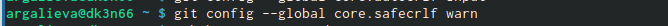

---
## Front matter
lang: ru-RU
title: "Лабораторная работа №3"
subtitle: "Операционные системы"
author:
  - Галиева Аделина Руслановна
institute:
  - Российский университет дружбы народов, Москва, Россия
 
date: 22 февраля 2023

## i18n babel
babel-lang: russian
babel-otherlangs: english

## Formatting pdf
toc: false
toc-title: Содержание
slide_level: 2
aspectratio: 169
section-titles: true
theme: metropolis
header-includes:
 - \metroset{progressbar=frametitle,sectionpage=progressbar,numbering=fraction}
 - '\makeatletter'
 - '\beamer@ignorenonframefalse'
 - '\makeatother'
---

## Актуальность

Оформление отчётов с помощью Markdown.

## Цели и задачи

Научиться оформлять отчёты с помощью легковесного языка разметки Markdown.

## Содержание исследования

1. Зададим имя и email владельца репозитория

{#fig:001 width=95%}

##

2. Настроим utf-8 в выводе сообщений git 

{#fig:002 width=95%}

##

3. Зададим имя начальной ветки 

{#fig:003 width=95%}

##

4. Параметр autocrlf 

{#fig:004 width=95%}

##

5. Параметр safecrlf 

{#fig:005 width=95%}

##

6. По алгоритму rsa с ключём размером 4096 бит 

{#fig:006 width=95%}

##

7. По алгоритму ed25519 

{#fig:007 width=95%}

##

8. Генерируем ключ 

{#fig:008 width=95%}

##

9. Выводим список ключей и копируем отпечаток приватного ключа 

{#fig:009 width=95%}

##

10. Копируем наш сгенерированный PGP ключ в буфер обмена 

{#fig:010 width=95%}

##

11. Используя введёный email, указываем Git применять его при подписи коммитов 

{#fig:011 width=95%}

##

12. Авторизовываемся 

{#fig:012 width=95%}

## 

13. Создаём репозиторий

{#fig:013 width=95%}

##

14. Переходим в каталог курса 

{#fig:014 width=95%}

##

15. Удаляем лишние файлы 

{#fig:015 width=95%}

##

16. Создаём необходимые каталоги 

{#fig:016 width=95%}

##

17. Отправляем файлы на сервер 

{#fig:017 width=95%}

{#fig:018 width=95%}

## Результаты

- Выполнили отчёт в Markdown

## Итоговый слайд

В ходе выполения лабораторной работы, я научилась оформлять отчёты с помощью легковесного языка разметки Markdown.

:::

