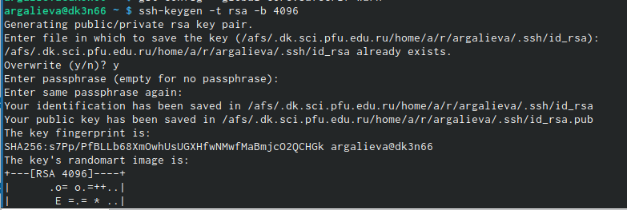
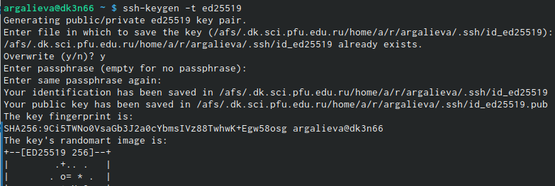

---
## Front matter
title: "Отчёт по лабораторной работе №3 (отчёт по лабораторной работе №2)"
subtitle: "Markdown"
author: "Аделина Руслановна Галиева"

## Generic otions
lang: ru-RU
toc-title: "Содержание"

## Bibliography
bibliography: bib/cite.bib
csl: pandoc/csl/gost-r-7-0-5-2008-numeric.csl

## Pdf output format
toc: true # Table of contents
toc-depth: 2
lof: true # List of figures
lot: true # List of tables
fontsize: 12pt
linestretch: 1.5
papersize: a4
documentclass: scrreprt
## I18n polyglossia
polyglossia-lang:
  name: russian
  options:
	- spelling=modern
	- babelshorthands=true
polyglossia-otherlangs:
  name: english
## I18n babel
babel-lang: russian
babel-otherlangs: english
## Fonts
mainfont: PT Serif
romanfont: PT Serif
sansfont: PT Sans
monofont: PT Mono
mainfontoptions: Ligatures=TeX
romanfontoptions: Ligatures=TeX
sansfontoptions: Ligatures=TeX,Scale=MatchLowercase
monofontoptions: Scale=MatchLowercase,Scale=0.9
## Biblatex
biblatex: true
biblio-style: "gost-numeric"
biblatexoptions:
  - parentracker=true
  - backend=biber
  - hyperref=auto
  - language=auto
  - autolang=other*
  - citestyle=gost-numeric
## Pandoc-crossref LaTeX customization
figureTitle: "Рис."
tableTitle: "Таблица"
listingTitle: "Листинг"
lofTitle: "Список иллюстраций"
lotTitle: "Список таблиц"
lolTitle: "Листинги"
## Misc options
indent: true
header-includes:
  - \usepackage{indentfirst}
  - \usepackage{float} # keep figures where there are in the text
  - \floatplacement{figure}{H} # keep figures where there are in the text
---

# Цель работы

Изучить идеологию и применение средств контроля версий.Освоить умения по работе с git.

# Выполнение лабораторной работы

1. Зададим имя и email владельца репозитория (рис. @fig:001)

{#fig:001 width=95%}

2. Настроим utf-8 в выводе сообщений git (рис. @fig:002)

{#fig:002 width=95%}

3. Зададим имя начальной ветки (риc. @fig:003)

{#fig:003 width=95%}

4. Параметр autocrlf (рис. @fig:004)

{#fig:004 width=95%}

5. Параметр safecrlf (рис. @fig:005)

{#fig:005 width=95%}

6. По алгоритму rsa с ключём размером 4096 бит (рис. @fig:006)

{#fig:006 width=95%}

7. По алгоритму ed25519 (рис. @fig:007)

{#fig:007 width=95%}

8. Генерируем ключ (рис. @fig:008)

{#fig:008 width=95%}

9. Выводим список ключей и копируем отпечаток приватного ключа (рис. @fig:009)

{#fig:009 width=95%}

10. Копируем наш сгенерированный PGP ключ в буфер обмена (рис. @fig:010)

{#fig:010 width=95%}

11. Используя введёный email, указываем Git применять его при подписи коммитов (рис. @fig:011)

{#fig:011 width=95%}

12. Авторизовываемся (рис. @fig:012)

{#fig:012 width=95%}

13. Создаём репозиторий (рис. @fig:013)

{#fig:013 width=95%}

14. Переходим в каталог курса (рис. @fig:014)

{#fig:014 width=95%}

15. Удаляем лишние файлы (рис. @fig:015)

{#fig:015 width=95%}

16. Создаём необходимые каталоги (рис. @fig:016)

{#fig:016 width=95%}

17. Отправляем файлы на сервер (рис. @fig:017) (рис. @fig:018)

{#fig:017 width=95%}

{#fig:018 width=95%}

# Контрольные вопросы

1. Что такое системы контроля версий (VCS) и для решения каких задач они предназначаются?

Системы контроля версий (Version Control System, VCS) применяются при работе нескольких человек над одним проектом. Обычно основное дерево проекта хранится в локальном
или удалённом репозитории, к которому настроен доступ для участников проекта. При
внесении изменений в содержание проекта система контроля версий позволяет их
фиксировать, совмещать изменения, произведённые разными участниками проекта,
производить откат к любой более ранней версии проекта, если это требуется

2. Объясните следующие понятия VCS и их отношения: хранилище, commit, история, рабочая копия.

* хранилище - пространство на накопителе где расположен репозиторий
* commit - сохранение состояния хранилища 
* история - список изменений хранилища (коммитов)
* рабочая копия - локальная копия сетевого репозитория, в которой работает программист. Текущее состояние файлов проекта, основанное на версии, загруженной из хранилища (обычно на последней)

3. Что представляют собой и чем отличаются централизованные и децентрализованные VCS? Приведите примеры VCS каждого вида.

Централизованные системы контроля версий представляют собой приложения типа клиент-сервер, когда репозиторий проекта существует в единственном экземпляре и хранится на сервере. Доступ к нему осуществлялся через специальное клиентское приложение. В качестве примеров таких программных продуктов можно привести CVS, Subversion.

Распределенные системы контроля версий (Distributed Version Control System, DVCS) позволяют хранить репозиторий (его копию) у каждого разработчика, работающего с данной системой. При этом можно выделить центральный репозиторий (условно), в который будут отправляться изменения из локальных и, с ним же эти локальные репозитории будут синхронизироваться. При работе с такой системой, пользователи периодически синхронизируют свои локальные репозитории с центральным и работают непосредственно со своей локальной копией. После внесения достаточного количества изменений в локальную копию они (изменения) отправляются на сервер. При этом сервер, чаще всего, выбирается условно, т.к. в большинстве DVCS нет такого понятия как “выделенный сервер с центральным репозиторием”.

4. Опишите действия с VCS при единоличной работе с хранилищем.

Один пользователь работает над проектом и по мере необходимости делает коммиты, сохраняя определенные этапы.

5. Опишите порядок работы с общим хранилищем VCS.

Несколько пользователей работают каждый над своей частью проекта. При этом каждый должен работать в своей ветки. При завершении работы ветка пользователя сливается с основной веткой проекта. 

6. Каковы основные задачи, решаемые инструментальным средством git?

* Ведение истории версий проекта: журнал (log), метки (tags), ветвления (branches).
* Работа с изменениями: выявление (diff), слияние (patch, merge).
* Обеспечение совместной работы: получение версии с сервера, загрузка обновлений на сервер.

7. Назовите и дайте краткую характеристику командам git.

* git config - установка параметров
* git status - полный список изменений файлов, ожидающих коммита
* git add . - сделать все измененные файлы готовыми для коммита.
* git commit -m "[descriptive message]" - записать изменения с заданным сообщением.
* git branch - список всех локальных веток в текущей директории.
* git checkout [branch-name] - переключиться на указанную ветку и обновить рабочую директорию.
* git merge [branch] — соединить изменения в текущей ветке с изменениями из заданной.
* git push - запушить текущую ветку в удаленную ветку.
* git pull - загрузить историю и изменения удаленной ветки и произвести слияние с текущей веткой.

8. Приведите примеры использования при работе с локальным и удалённым репозиториями.

* git remote add [имя] [url] — добавляет удалённый репозиторий с заданным именем;
* git remote remove [имя] — удаляет удалённый репозиторий с заданным именем;
* git remote rename [старое имя] [новое имя] — переименовывает удалённый репозиторий;
* git remote set-url [имя] [url] — присваивает репозиторию с именем новый адрес;
* git remote show [имя] — показывает информацию о репозитории.

9. Что такое и зачем могут быть нужны ветви (branches)?

Ветвление — это возможность работать над разными версиями проекта: вместо одного списка с упорядоченными коммитами история будет расходиться в определённых точках. Каждая ветвь содержит легковесный указатель HEAD на последний коммит, что позволяет без лишних затрат создать много веток. Ветка по умолчанию называется master, но лучше назвать её в соответствии с разрабатываемой в ней функциональностью.

10. Как и зачем можно игнорировать некоторые файлы при commit?

Зачастую нам не нужно, чтобы Git отслеживал все файлы в репозитории, потому что в их число могут входить

# Выводы

Я изучила идеологию и применение средств контроля версий. Освоила умения по работе с git.

