---
## Front matter
lang: ru-RU
title: Лабораторная работа №4
subtitle: Операционные системы
author:
  - Галиева Аделина Руслановна
institute:
  - Российский университет дружбы народов, Москва, Россия
date: 1 марта 2023

## i18n babel
babel-lang: russian
babel-otherlangs: english

## Formatting pdf
toc: false
toc-title: Содержание
slide_level: 2
aspectratio: 169
section-titles: true
theme: metropolis
header-includes:
 - \metroset{progressbar=frametitle,sectionpage=progressbar,numbering=fraction}
 - '\makeatletter'
 - '\beamer@ignorenonframefalse'
 - '\makeatother'
---

## Актуальность

Научиться взаимодействовать с системой посредством командной строки.

## Цели и задачи

Приобретение практических навыков взаимодействия пользователя с системой посредством командной строки.

## Содержание исследования

1. Определяем полное имя вашего домашнего каталога

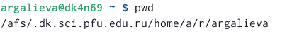{#fig:001 width=90%}

##

2. Перейдем в каталог /tmp, при помощи команды cd /tmp 

{#fig:002 width=90%}

##

3. Выводим на экран содержимое каталога /tmp. Для этого используйте команду ls
с различными опциями 

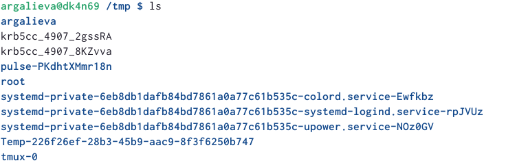{#fig:003 width=90%}

##

Содержимое каталога со скрытыми файлами применив ls -a 

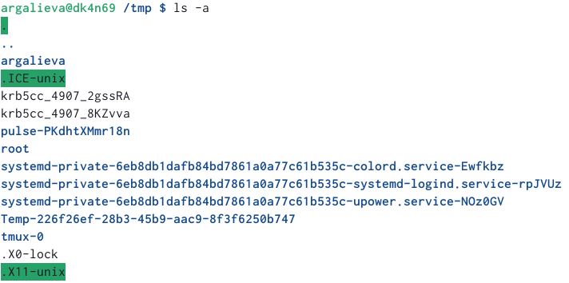{#fig:004 width=90%}

##

Подробное содержимое каталога можем увидеть, применив ls -l 

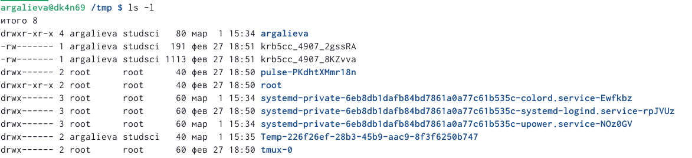{#fig:005 width=90%}

##

Применив ls -f, можем увидеть файлы списком  

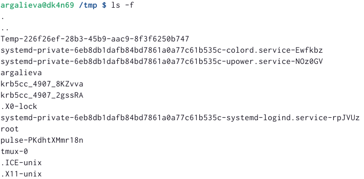{#fig:006 width=90%}

##

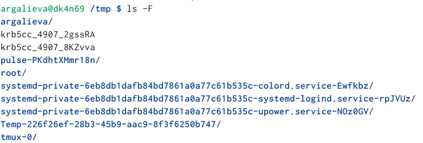{#fig:007 width=90%}

##

4. Определим, есть ли в каталоге /var/spool подкаталог с именем cron? Да, есть 

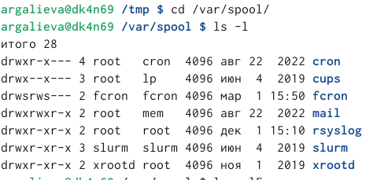{#fig:008 width=90%}

##  

5. Переходим в домашний каталог и выводим на экран его содержимое. Определяем, кто является владельцем файлов и подкаталогов при помощи команды ls -alF 

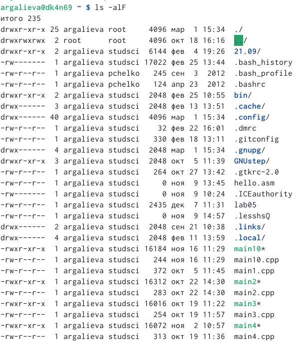{#fig:009 width=90%}

##

6. В домашнем каталоге создаем новый каталог с именем newdir. В каталоге ~/newdir создаем новый каталог с именем morefun. В домашнем каталоге создаем одной командой три новых каталога с именами
letters, memos, misk. Затем удаляем эти каталоги одной командой. Попробуем удалить ранее созданный каталог ~/newdir командой rm. Проверяем, был ли каталог удалён. Удаляем каталог ~/newdir/morefun из домашнего каталога. Проверяем, был ли каталог удалён  

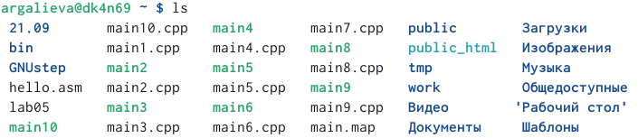{#fig:010 width=90%}

##

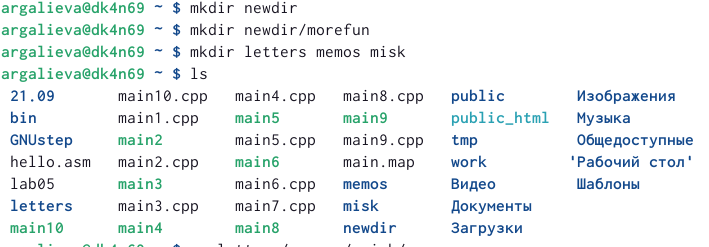{#fig:011 width=90%}

##

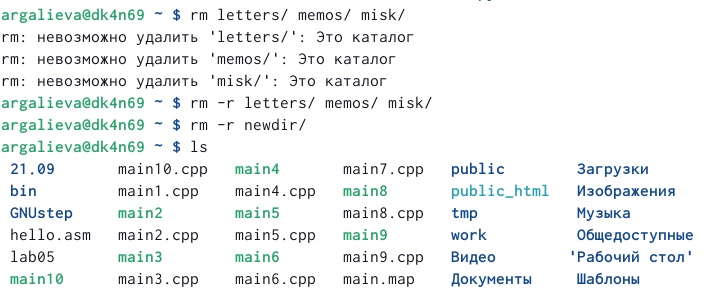{#fig:012 width=90%}

##

7. С помощью команды man определяем, какую опцию команды ls нужно использовать для просмотра содержимое не только указанного каталога, но и подкаталогов, входящих в него. Введя в консоли man ls, получаем справку и в ней вводим ключ -R 

{#fig:013 width=90%}

##

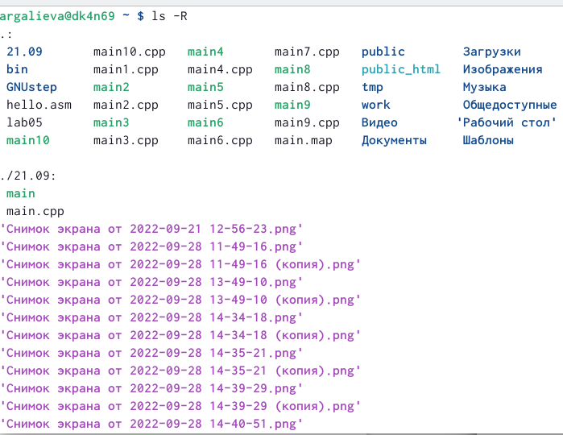{#fig:014 width=90%}

##

8. С помощью команды man определите набор опций команды ls, позволяющий отсортировать по времени последнего изменения выводимый список содержимого каталога с развёрнутым описанием файлов. Введя в консоли man ls, получаем справку и в ней вводим ключ -t 

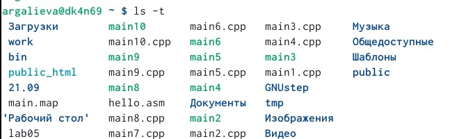{#fig:015 width=90%}

##

9. Справка по команде cd 

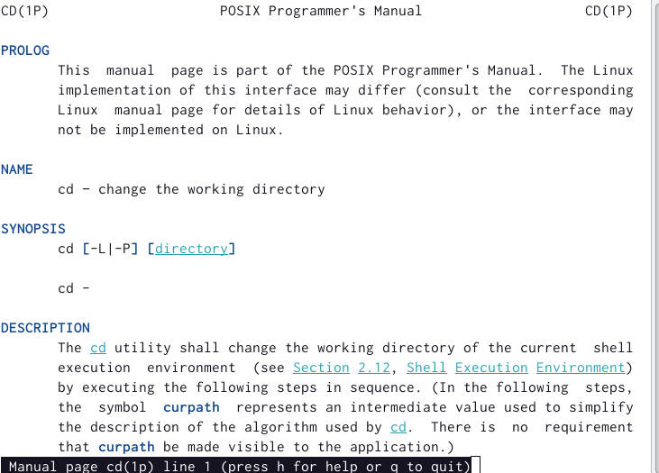{#fig:016 width=90%}

##

Справка по команде pwd 

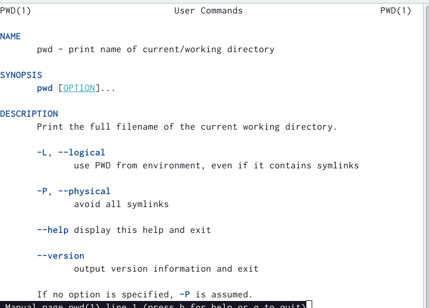{#fig:017 width=90%}

##

Справка по команде mkdir 

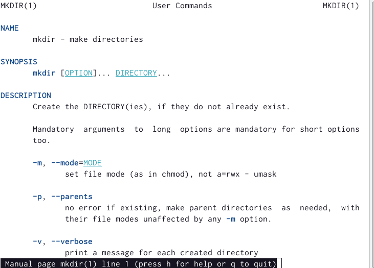{#fig:018 width=90%}

##

Справка по команде rmdir 

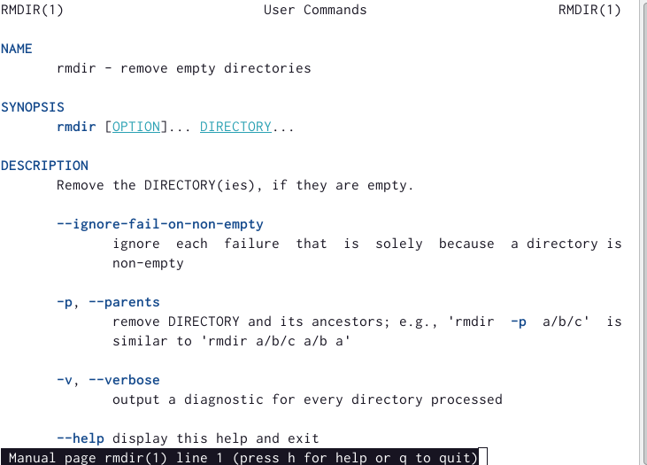{#fig:019 width=90%}

##

Справка по команде rm 

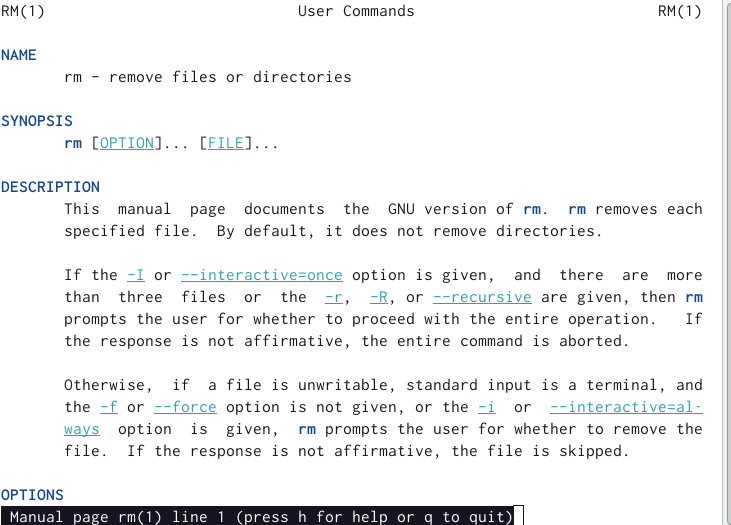{#fig:020 width=90%}

##

10. Используя информацию, полученную при помощи команды history, выполним модификацию и исполнение нескольких команд из буфера команд 

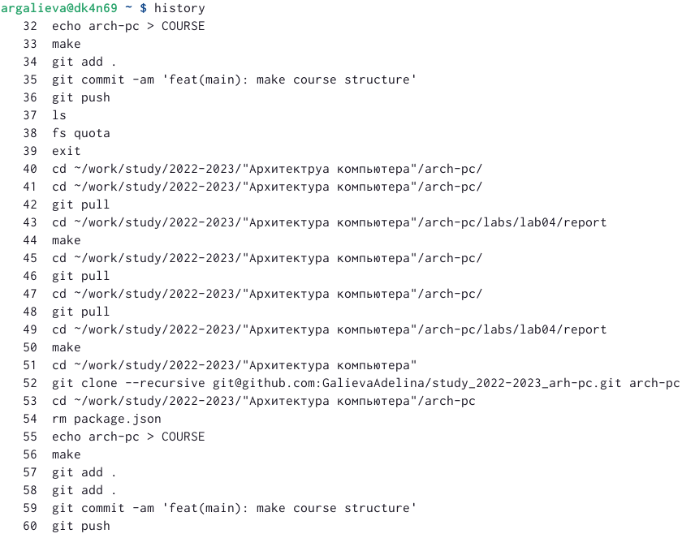{#fig:021 width=90%}

##

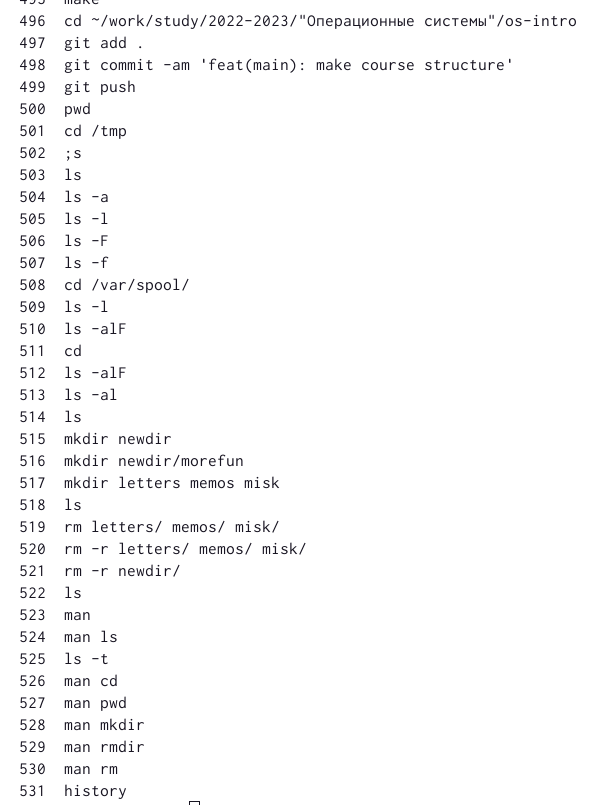{#fig:022 width=90%}

## Результаты

В ходе выполнения лабораторной работы, я научилась взаимодействовать с системрй посредством командной строки.

## Итоговый слайд

Я приобрела практических навыков взаимодействия пользователя с системой посредством командной строки.

