---
## Front matter
title: "Отчёт по лабораторной работе №4"
subtitle: "Основы интерфейса взаимодействия пользователя с системой Unix на уровне командной строки"
author: "Галиева Аделина Руслановна"

## Generic otions
lang: ru-RU
toc-title: "Содержание"

## Bibliography
bibliography: bib/cite.bib
csl: pandoc/csl/gost-r-7-0-5-2008-numeric.csl

## Pdf output format
toc: true # Table of contents
toc-depth: 2
lof: true # List of figures
lot: true # List of tables
fontsize: 12pt
linestretch: 1.5
papersize: a4
documentclass: scrreprt
## I18n polyglossia
polyglossia-lang:
  name: russian
  options:
	- spelling=modern
	- babelshorthands=true
polyglossia-otherlangs:
  name: english
## I18n babel
babel-lang: russian
babel-otherlangs: english
## Fonts
mainfont: PT Serif
romanfont: PT Serif
sansfont: PT Sans
monofont: PT Mono
mainfontoptions: Ligatures=TeX
romanfontoptions: Ligatures=TeX
sansfontoptions: Ligatures=TeX,Scale=MatchLowercase
monofontoptions: Scale=MatchLowercase,Scale=0.9
## Biblatex
biblatex: true
biblio-style: "gost-numeric"
biblatexoptions:
  - parentracker=true
  - backend=biber
  - hyperref=auto
  - language=auto
  - autolang=other*
  - citestyle=gost-numeric
## Pandoc-crossref LaTeX customization
figureTitle: "Рис."
tableTitle: "Таблица"
listingTitle: "Листинг"
lofTitle: "Список иллюстраций"
lotTitle: "Список таблиц"
lolTitle: "Листинги"
## Misc options
indent: true
header-includes:
  - \usepackage{indentfirst}
  - \usepackage{float} # keep figures where there are in the text
  - \floatplacement{figure}{H} # keep figures where there are in the text
---

# Цель работы

Приобретение практических навыков взаимодействия пользователя с системой посредством командной строки.

# Выполнение лабораторной работы

1. Определяем полное имя вашего домашнего каталога (рис. @fig:001)

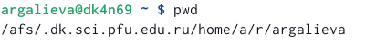{#fig:001 width=90%}

2. Перейдем в каталог /tmp, при помощи команды cd /tmp (рис. @fig:002)

{#fig:002 width=90%}

3. Выводим на экран содержимое каталога /tmp. Для этого используйте команду ls
с различными опциями (рис. @fig:003)

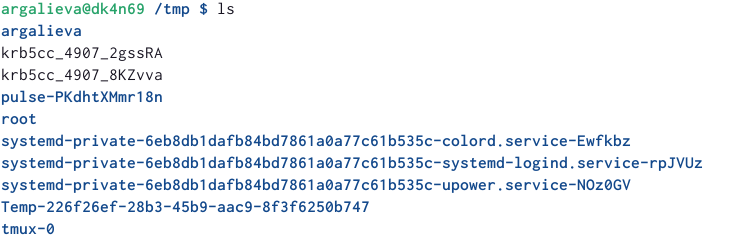{#fig:003 width=90%}

Содержимое каталога со скрытыми файлами применив ls -a (рис. @fig:004)

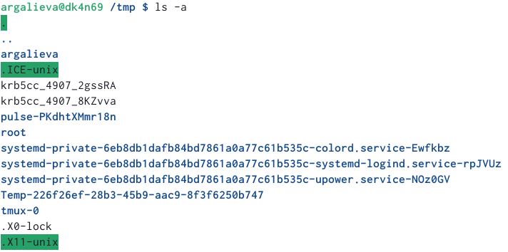{#fig:004 width=90%}

Подробное содержимое каталога можем увидеть, применив ls -l (рис. @fig:005) 

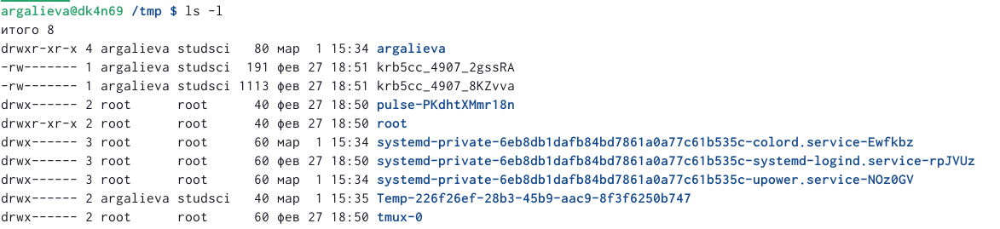{#fig:005 width=90%}

Применив ls -f, можем увидеть файлы списком  (рис. @fig:006) (рис. @fig:007) 

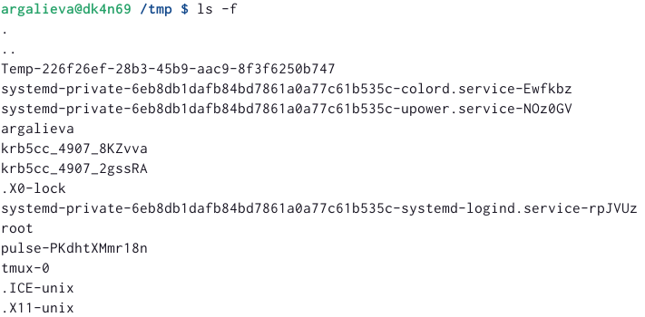{#fig:006 width=90%}

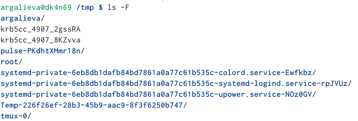{#fig:007 width=90%}

4. Определим, есть ли в каталоге /var/spool подкаталог с именем cron? Да, есть (рис. @fig:008) 

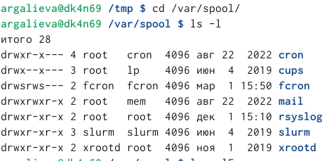{#fig:008 width=90%}

5. Переходим в домашний каталог и выводим на экран его содержимое. Определяем, кто является владельцем файлов и подкаталогов при помощи команды ls -alF (рис. @fig:009) 

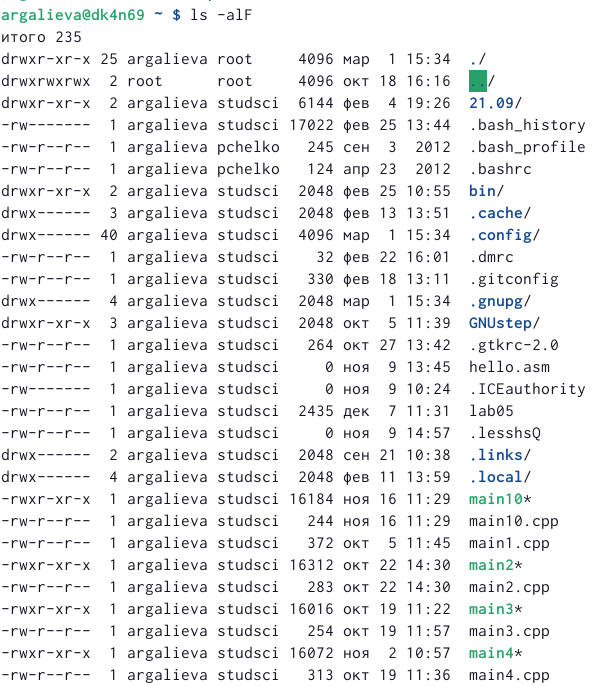{#fig:009 width=90%}

6. В домашнем каталоге создаем новый каталог с именем newdir. В каталоге ~/newdir создаем новый каталог с именем morefun. В домашнем каталоге создаем одной командой три новых каталога с именами
letters, memos, misk. Затем удаляем эти каталоги одной командой. Попробуем удалить ранее созданный каталог ~/newdir командой rm. Проверяем, был ли каталог удалён. Удаляем каталог ~/newdir/morefun из домашнего каталога. Проверяем, был ли каталог удалён  (рис. @fig:010) (рис. @fig:011) (рис. @fig:012) 

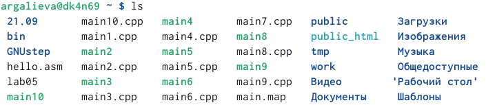{#fig:010 width=90%}

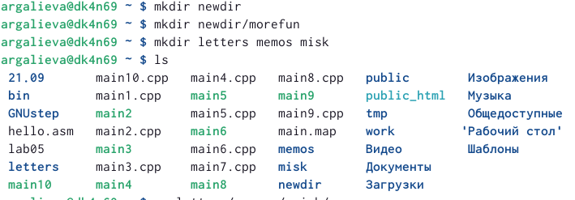{#fig:011 width=90%}

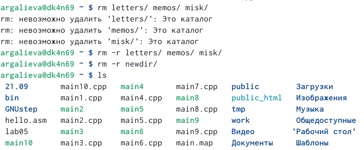{#fig:012 width=90%}

7. С помощью команды man определяем, какую опцию команды ls нужно использовать для просмотра содержимое не только указанного каталога, но и подкаталогов, входящих в него. Введя в консоли man ls, получаем справку и в ней вводим ключ -R (рис. @fig:013) (рис. @fig:014) 

{#fig:013 width=90%}

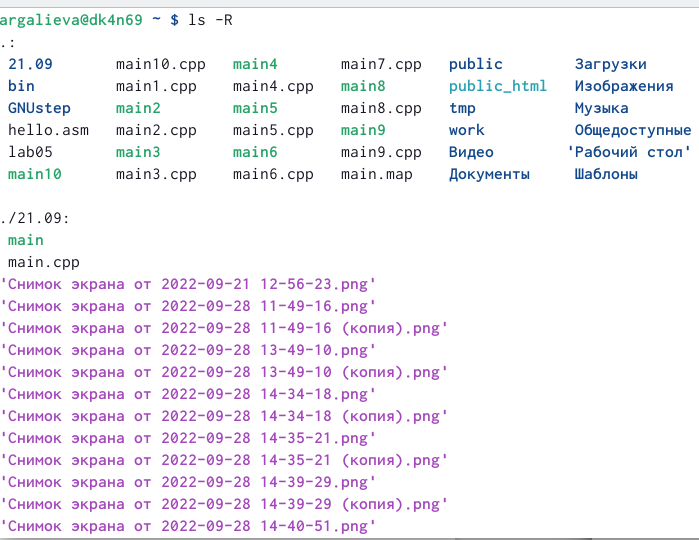{#fig:014 width=90%}

8. С помощью команды man определите набор опций команды ls, позволяющий отсортировать по времени последнего изменения выводимый список содержимого каталога с развёрнутым описанием файлов. Введя в консоли man ls, получаем справку и в ней вводим ключ -t (рис. @fig:015) 

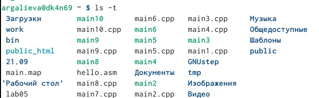{#fig:015 width=90%}

9. Справка по команде cd (рис. @fig:016) 

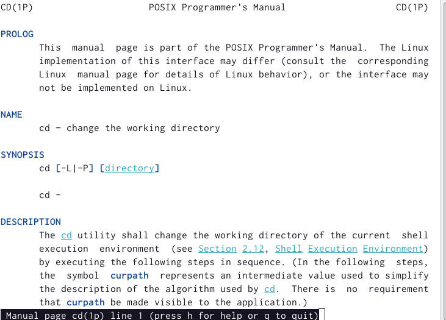{#fig:016 width=90%}

Справка по команде pwd (рис. @fig:017) 

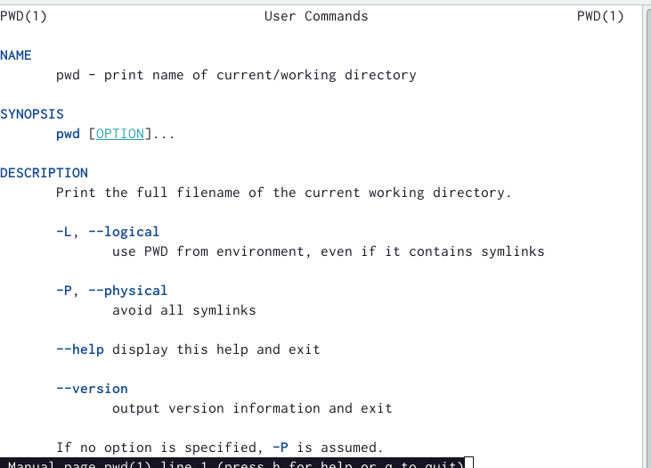{#fig:017 width=90%}

Справка по команде mkdir (рис. @fig:018) 

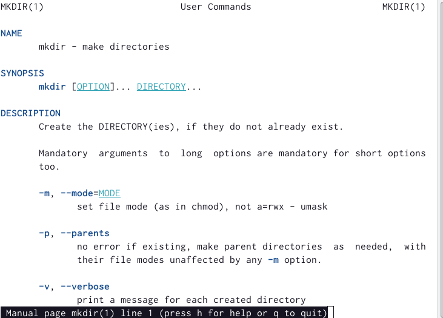{#fig:018 width=90%}

Справка по команде rmdir (рис. @fig:019) 

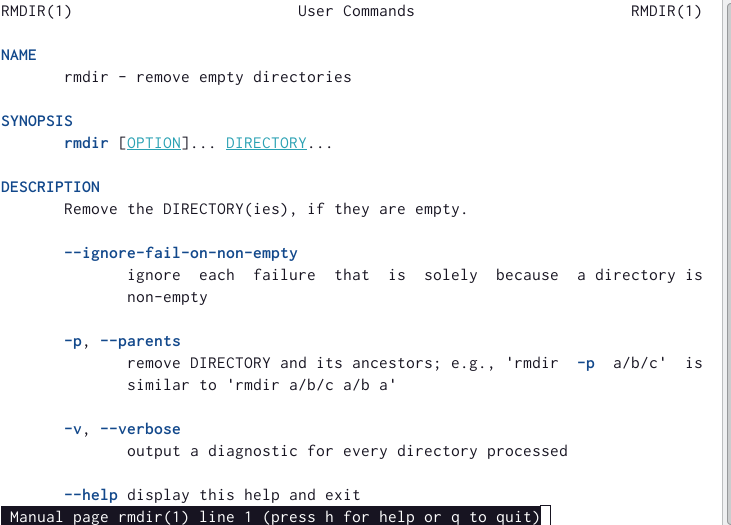{#fig:019 width=90%}

Справка по команде rm (рис. @fig:020) 

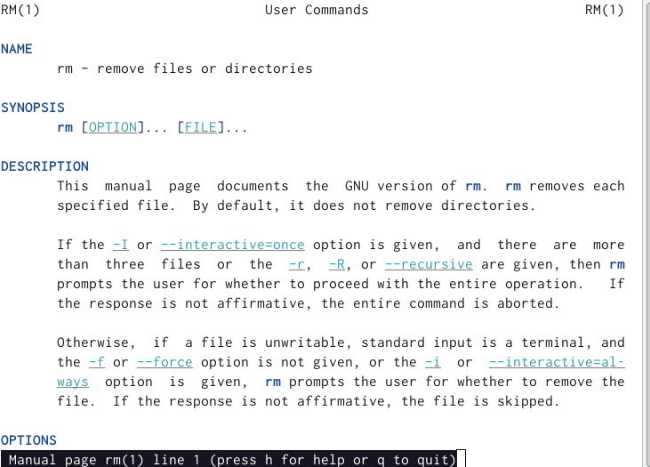{#fig:020 width=90%}

10. Используя информацию, полученную при помощи команды history, выполним модификацию и исполнение нескольких команд из буфера команд (рис. @fig:021) (рис. @fig:022) 

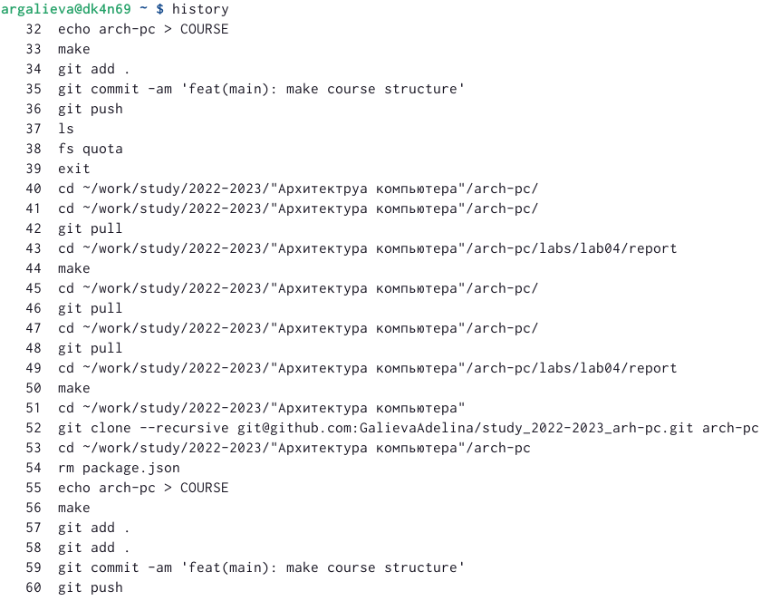{#fig:021 width=90%}

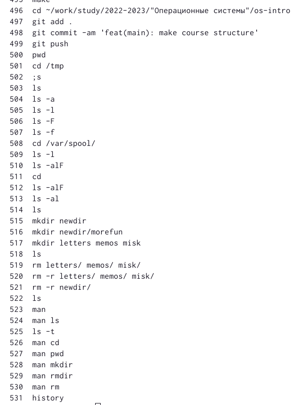{#fig:022 width=90%}

# Контрольные вопросы 
1. Что такое командная строка? Ответ: текстовый интерфейс взаимодействия пользователя с системой
2. Припомощикакойкомандыможноопределитьабсолютныйпутьтекущего каталога? Ответ: команда pwd, пример:
    • cd /var/www
    • pwd
    • /var/www/
3. При помощи какой команды и каких опций можно определить только тип файлов и их имена в текущем каталоге? Ответ: коман- да ls с опцией -F.
4. Какие файлы считаются скрытыми? Как получить информацию о скрытых файлах? Ответ: Некоторые файлы в операционной си- стеме скрыты от просмотра и обычно используются для настройки рабочей среды. Имена таких файлов начинаются с точки. информацию о них можно получить с помощью команды ls с опцией -a.
5. При помощи каких команд можно удалить файл и каталог? Можно ли это сделать одной и той же командой? Ответ: С помощью команды rm мож- но удалить как отдельный файл так и целый каталог, в случае каталога необходимо указать опцию -r.
6. Как определить, какие команды выполнил пользователь в сеансе работы? Ответ: с помощью команды history.
7. Каким образом можно исправить и запустить на выполнение команду, ко- торую пользователь уже использовал в сеансе работы? Приведите примеры Ответ: узнать порядковый номер этой команды с помощью history затем изменить её следующим образом: !:s//
8. Можно ли в одной строке записать несколько команд? Если да, то как? Ответ: да, можно, необходимо разделить команды символом точки с запятой в таком случае они будут выполняться последовательно в том порядке, в котором они записаны пример: cd /tmp/; ls -l;pwd
9. Что такое символ экранирования? Ответ:символэкранирования (обратный слэш)-символ, экранирующие управляющие конструкции и символы в названии файлов и папок. Пример: ls /etc/nginx
10. Какая информация выводится на экран о файлах и каталогах, если исполь- зуется опция l в команде ls? Ответ: тип файла, право доступа, число ссылок, владелец, размер, дата последней ревизии, имя файла или каталога.
11. Что такое относительный путь к файлу? Ответ: относительный путь - путь к тому или иному файлу или директории относительной текущей рабочей директории, пример: папка /www/ в дирек- тории /var/ абсолютный путь: /var/www/ относительный путь(если рабочая директория - /var/): /www/
12. Как получить информацию об интересующей вас команде? Ответ: можно попробовать найти информацию по использованию с помощью утилиты man, или попробовать ввести опцию –help.
13. Какая клавиша или комбинация клавиш служит для автоматического дополнения вводимых команд? Ответ: клавиша Tab.

# Выводы

Я приобрела практические навыки взаимодействия пользователя с системой посредством командной строки.

# Список литературы{.unnumbered}

::: {#refs}
:::
