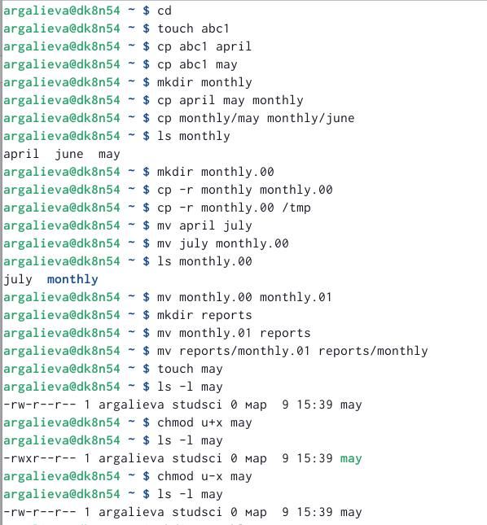
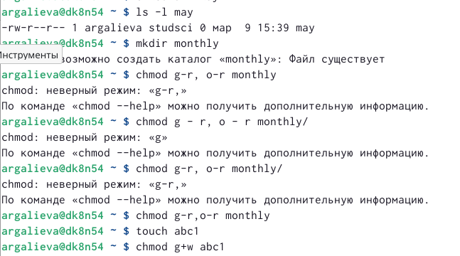
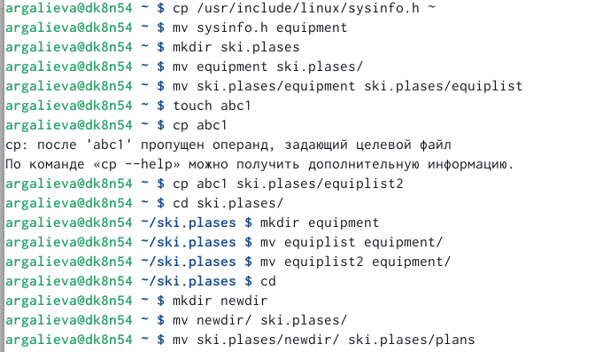
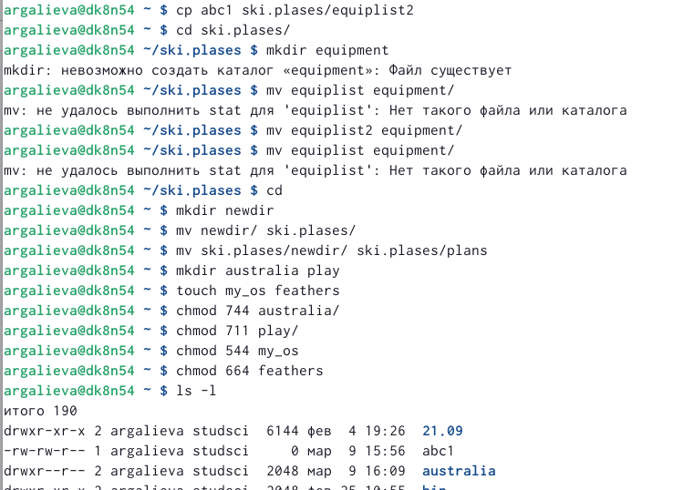
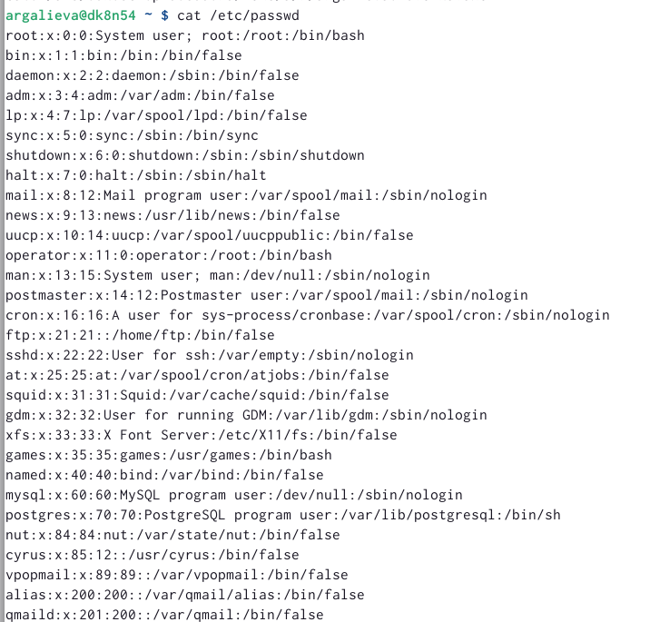
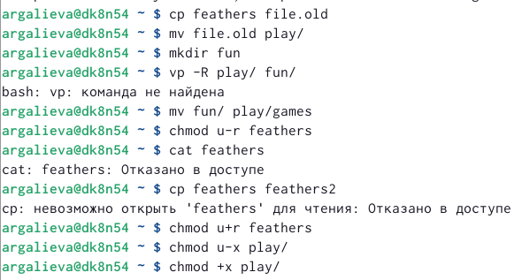
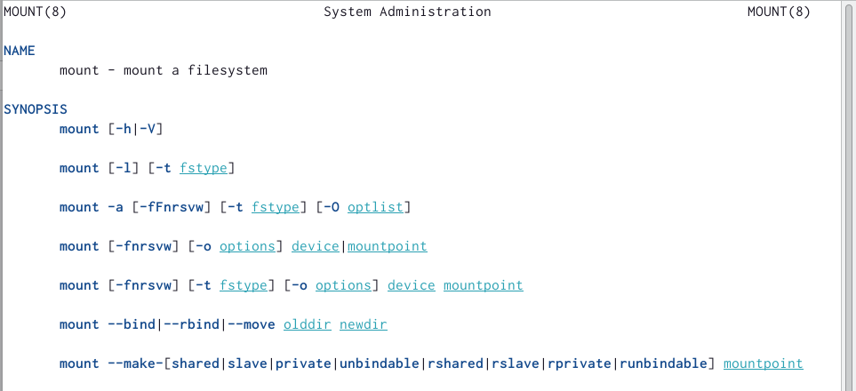
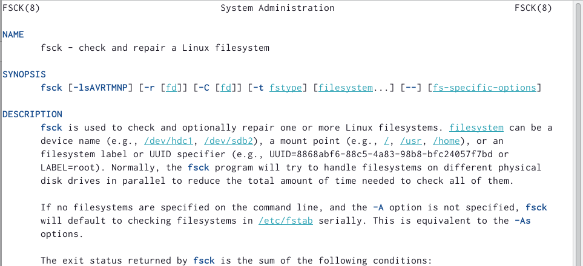
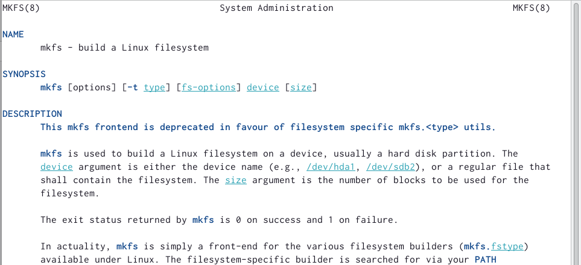
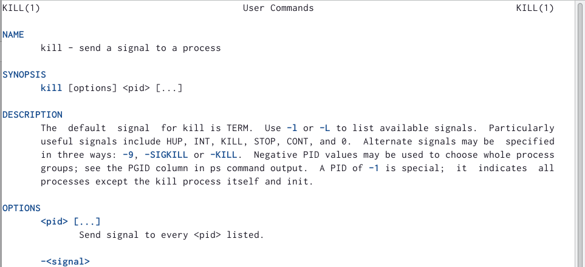

---
## Front matter
lang: ru-RU
title: Лабораторная работа №5
subtitle: Операционные системы
author:
  - Галиева Аделина Руслановна
institute:
  - Российский университет дружбы народов, Москва, Россия
date: 10 марта 2023

## i18n babel
babel-lang: russian
babel-otherlangs: english

## Formatting pdf
toc: false
toc-title: Содержание
slide_level: 2
aspectratio: 169
section-titles: true
theme: metropolis
header-includes:
 - \metroset{progressbar=frametitle,sectionpage=progressbar,numbering=fraction}
 - '\makeatletter'
 - '\beamer@ignorenonframefalse'
 - '\makeatother'
---

## Актуальность

Ознакомление с файловой системой Linux.

## Цели и задачи

Ознакомление с файловой системой Linux, её структурой, именами и содержанием
каталогов. Приобретение практических навыков по применению команд для работы
с файлами и каталогами, по управлению процессами (и работами), по проверке исполь-
зования диска и обслуживанию файловой системы.

## Содержание исследования

1. Выполнение всех примеров, приведённых в первой части описания лабораторной работы. 

{#fig:001 width=90%}

{#fig:002 width=90%}

##

2. Скопируем файл /usr/include/sys/io.h в домашний каталог и назовём его equipment. Такого нет, используем другой. В домашнем каталоге создаём директорию ~/ski.plases и перемещаем файл equipment в каталог ~/ski.plases. Переименовываем файл ~/ski.plases/equipment в ~/ski.plases/equiplist. Создаём в домашнем каталоге файл abc1 и скопируем его в каталог ~/ski.plases, назовём его equiplist2. Создадим каталог с именем equipment в каталоге ~/ski.plases. Переместим файлы ~/ski.plases/equiplist и equiplist2 в каталог ~/ski.plases/equipment. Создаём и перемещаем каталог ~/newdir в каталог ~ski.plases и называем его plans. 

{#fig:003 width=90%}

##

3. Определяем опции команды chmod, необходимые для того, чтобы присвоить перечисленным файлам из хода работы нужные права доступа. 

{#fig:004 width=90%}

##

4. Просматриваем содержимое файла /etc/passwd. 

{#fig:005 width=90%}

##

Выполняем все указанные действия по перемещению файлов и каталогов. 

{#fig:006 width=90%}

##

Если мы попытаемся просмотреть файл feathers командой cat, то нам будет отказано. 

Если мы попытаемся скопировать файл feathers, то у нас не получится сделать это, поскольку мы ограничили себя в доступе для чтения. 

##

5. Прочитаем man по командам mount, fsck, mkfs, kill и кратко их охарактеризуйте, приведя примеры.

##

{#fig:007 width=90%}

##

{#fig:008 width=90%}

##

{#fig:009 width=90%}

##

{#fig:010 width=90%}

##

{#fig:011 width=90%}

##

{#fig:012 width=90%}

##

{#fig:013 width=90%}

##

{#fig:014 width=90%}

## Результаты

Я ознакомилась с файловой системой Linux, её структурой, именами и содержанием каталогов. Приобрела практические навыки по применению команд для работы с файлами и каталогами, по управлению процессами (и работами), по проверке использования диска и обслуживанию файловой системы.

## Итоговый слайд

В ходе выполнения лабораторной работы, я ознакомилась с файловой системой Linux.

