---
## Front matter
lang: ru-RU
title: Лабораторная работа №6
subtitle: Операционные системы
author:
  - Галиева Аделина Руслановна
institute:
  - Российский университет дружбы народов, Москва, Россия
date: 15 марта 2023

## i18n babel
babel-lang: russian
babel-otherlangs: english

## Formatting pdf
toc: false
toc-title: Содержание
slide_level: 2
aspectratio: 169
section-titles: true
theme: metropolis
header-includes:
 - \metroset{progressbar=frametitle,sectionpage=progressbar,numbering=fraction}
 - '\makeatletter'
 - '\beamer@ignorenonframefalse'
 - '\makeatother'
---

## Актуальность

Ознакомиться с инструментами поиска файлов и фильтрации текстовых данных. 

## Цели и задачи

Ознакомление с инструментами поиска файлов и фильтрации текстовых данных. Приобретение практических навыков: по управлению процессами (и заданиями), по проверке использования диска и обслуживанию файловых систем

## Содержание исследования

1. Осуществляем вход в систему, используя соответствующее имя пользователя. Записываем в файл file.txt названия файлов, содержащиеся в каталоге /etc. Дописываем в этот же файл названия файлов, содержащиеся в вашем домашнем каталоге. 

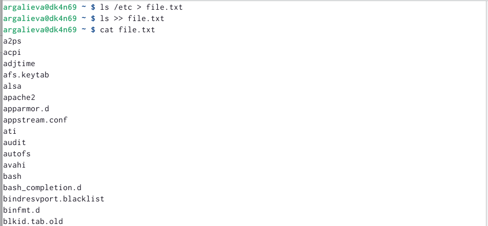{#fig:001 width=70% }

##

2. Выводим имена всех файлов из file.txt, имеющих расширение .conf, после чего записываем их в новый текстовой файл conf.txt. 

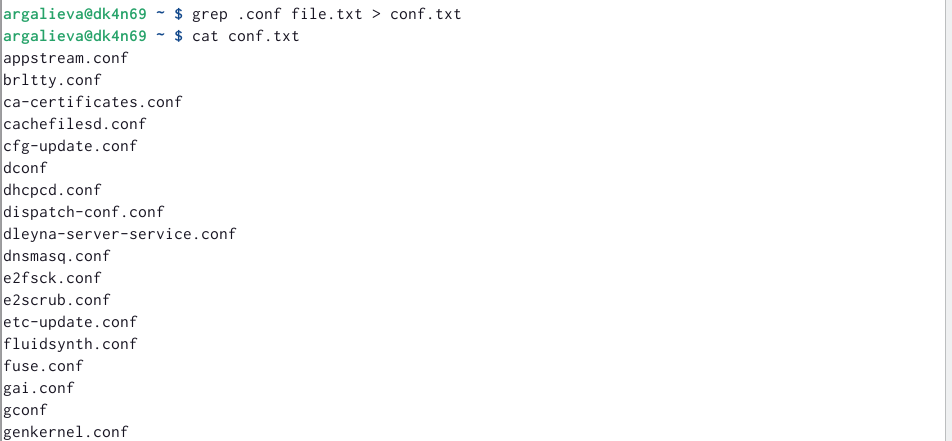{#fig:002 width=70% }

##

3. Определяем, какие файлы в нашем домашнем каталоге имеют имена, начинавшиеся с символа c. 

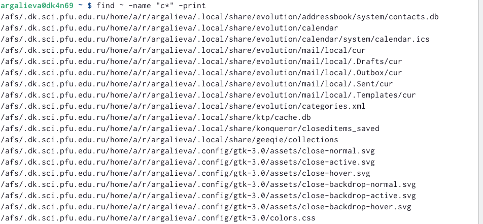{#fig:003 width=70% }

##

4. Выводим на экран (постранично) имена файлов из каталога /etc, начинающиеся с символа h.

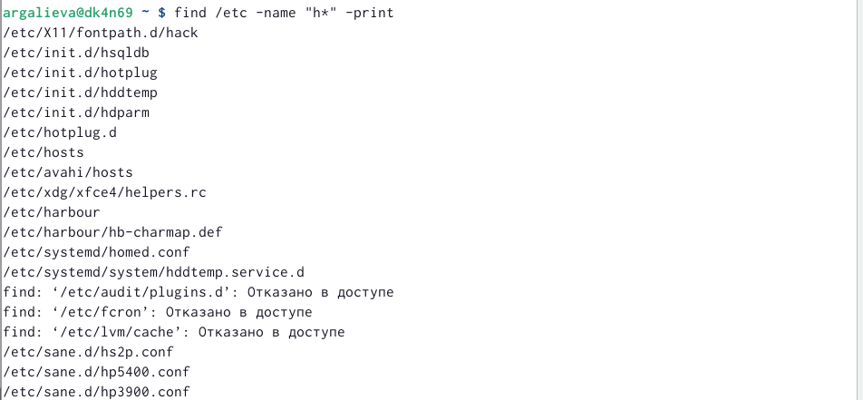{#fig:004 width=70% }

##

5. Запускаем в фоновом режиме процесс, который будет записывать в файл ~/logfile файлы, имена которых начинаются с log.Удаляем файл ~/logfile. 

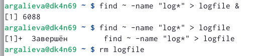{#fig:005 width=70% }

##

6. Запускаем из консоли в фоновом режиме редактор gedit. Определяем идентификатор процесса gedit, используя команду ps, конвейер и фильтр grep.Прочитаем справку (man) команды kill, после чего используем её для завершения процесса gedit. 

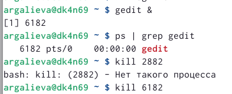{#fig:006 width=70% }

##

7. Выполняемм команды df и du, предварительно получив более подробную информацию об этих командах, с помощью команды man.

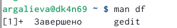{#fig:007 width=70% }

##

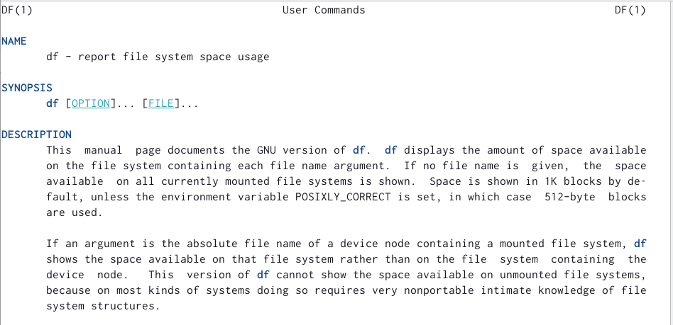{#fig:008 width=70% }

##

{#fig:009 width=70% }

##

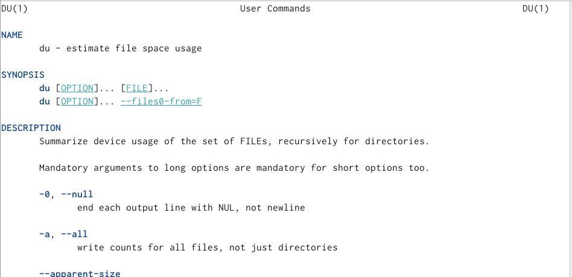{#fig:010 width=70% }

##

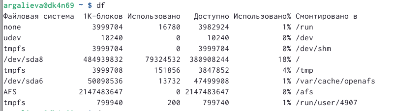{#fig:011 width=70% }

##

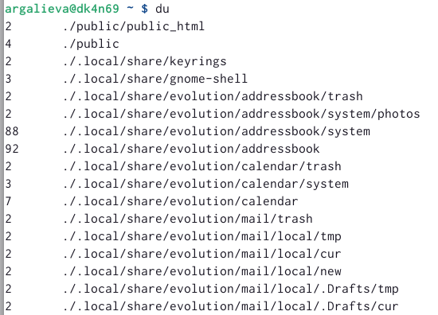{#fig:012 width=70% }

##
8. Воспользуемся справкой команды find, выведим имена всех директорий, имеющихся в нашем домашнем каталоге.

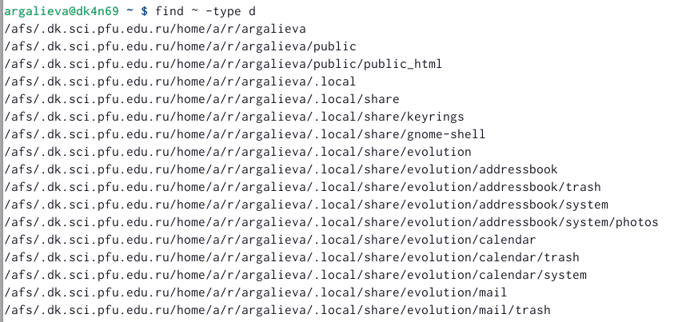{#fig:013 width=70% }

## Результаты

Я ознакомилась с инструментами поиска файлов и фильтрации текстовых данных. Приобрела практические навыки: по управлению процессами, по проверке  использования диска и обслуживанию файловых систем.

## Итоговый слайд

В ходе выполнения лабораторной работы, я ознакомилась с инструментами поиска файлов и фильтрации текстовых данных.

