---
## Front matter
lang: ru-RU
title: Лабораторная работа №7
subtitle: Операционные системы
author:
  - Галиева Аделина Руслановна
institute:
  - Российский университет дружбы народов, Москва, Россия
date: 22 марта 2023

## i18n babel
babel-lang: russian
babel-otherlangs: english

## Formatting pdf
toc: false
toc-title: Содержание
slide_level: 2
aspectratio: 169
section-titles: true
theme: metropolis
header-includes:
 - \metroset{progressbar=frametitle,sectionpage=progressbar,numbering=fraction}
 - '\makeatletter'
 - '\beamer@ignorenonframefalse'
 - '\makeatother'
---

## Актуальность

Освоение основных возможностей командной оболочки Midnight Commander.

## Цели и задачи

Освоение основных возможностей командной оболочки Midnight Commander. Приобретение навыков практической работы по просмотру каталогов и файлов; манипуляций
с ними.

## Содержание исследования

1. Изучаем информацию о mc, вызвав в командной строке man mc. 

##

{#fig:001 width=70% }

##

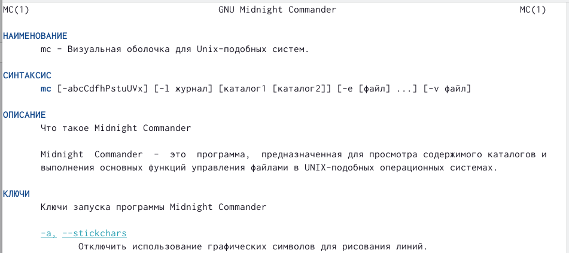{#fig:002 width=70% }

##

2. Выполните несколько операций в mc, используя управляющие клавиши (операции с панелями; выделение/отмена выделения файлов, копирование/перемещение файлов, получение информации о размере и правах доступа на файлы и/или каталоги и т.п.). 

##

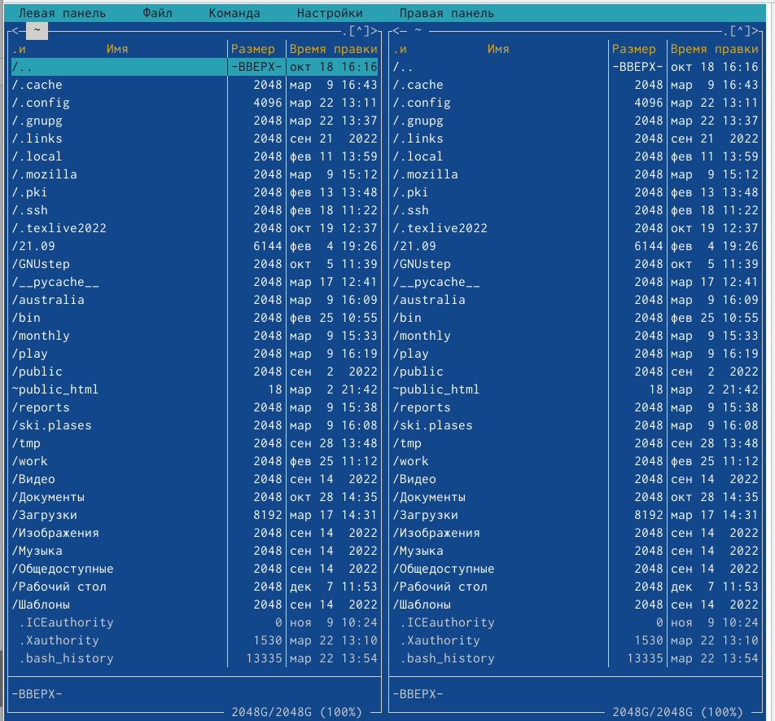{#fig:003 width=70% }

##

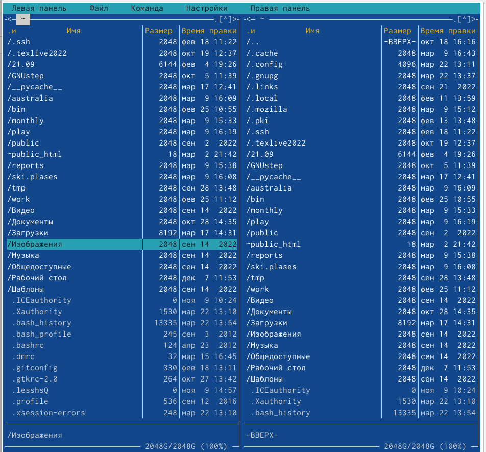{#fig:004 width=70% }

##

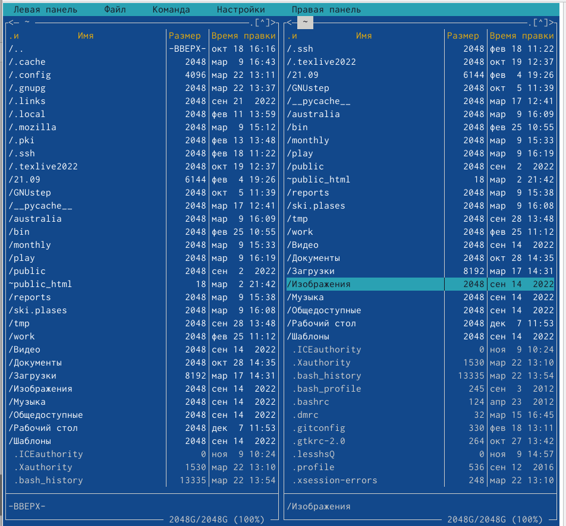{#fig:005 width=70% }

##

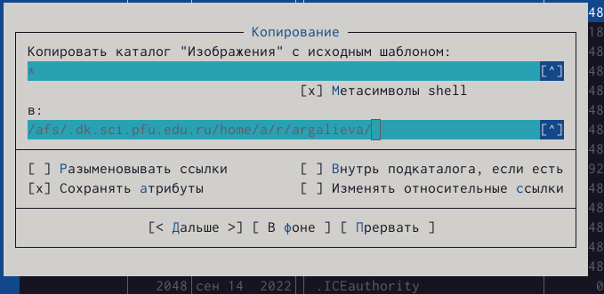{#fig:006 width=70% }

##

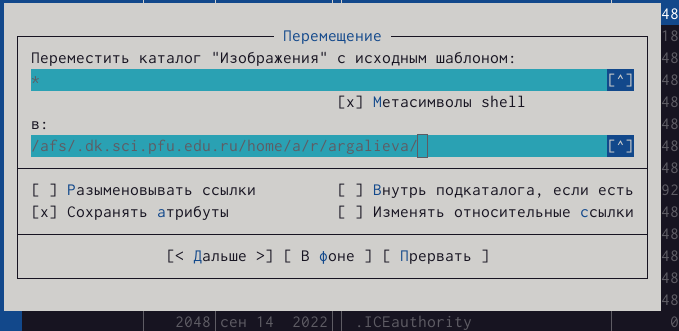{#fig:007 width=70% }

3. Используем возможности подменю Файл.

##

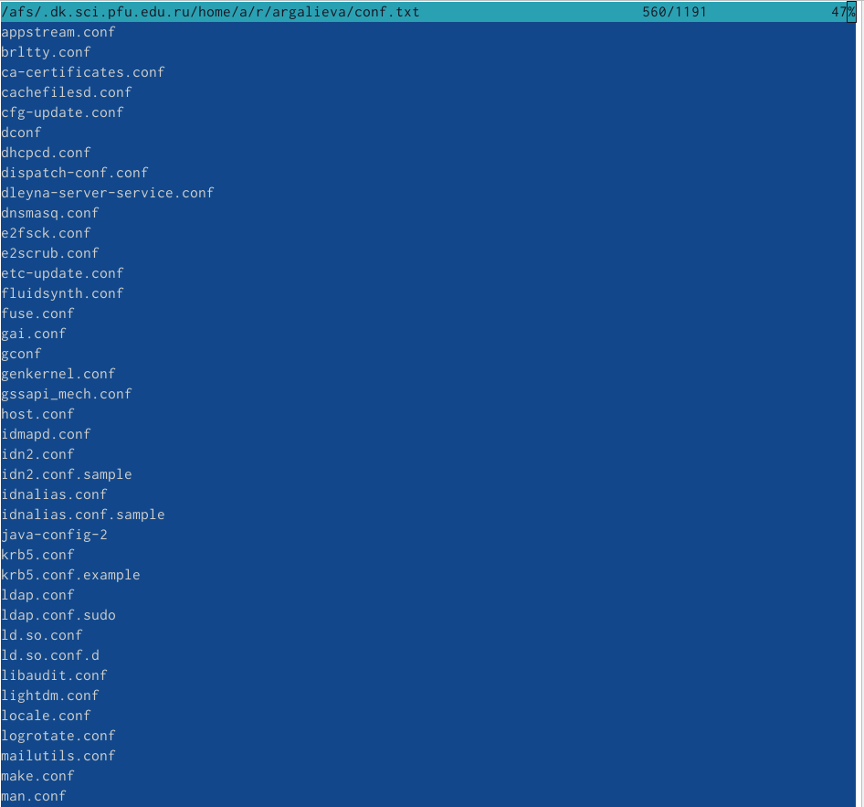{#fig:008 width=70% }

##

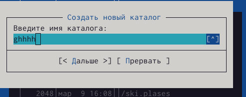{#fig:009 width=70% } 

##

4. С помощью соответствующих средств подменю Команда осуществляем. 

##

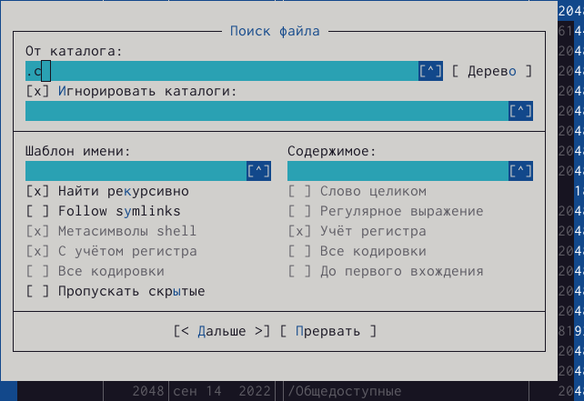{#fig:010 width=70% }

##

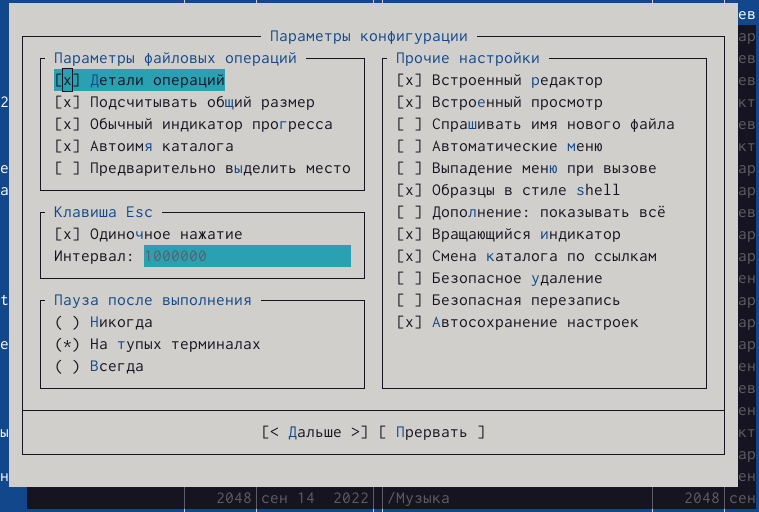{#fig:011 width=70% }

##

5. Создаём текстовой файл text.txt. Открываем этот файл с помощью встроенного в mc редактора. Вставляем в открытый файл небольшой фрагмент текста, скопированный из любого другого файла или Интернета. 

##

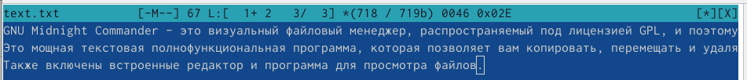{#fig:012 width=70% }

##

6. Проделываем с текстом следующие манипуляции, используя горячие клавиши: удаляем строку текста, выделяем фрагмент текста и скопируем его на новую строку, выделяем фрагмент текста и переносим его на новую строку, сохраняем файл, отменяеем последнее действие, переходим в конец файла (нажав комбинацию клавиш) и пишем некоторый текст, переходим в начало файла (нажав комбинацию клавиш) и пишем некоторый текст, сохраняем и закрываем файл. 

##

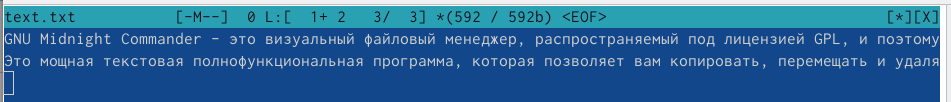{#fig:013 width=70% }

##

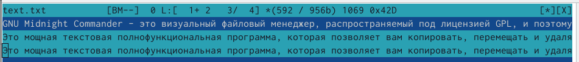{#fig:014 width=70% }

##

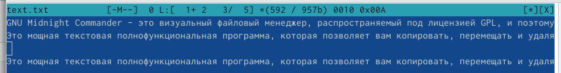{#fig:015 width=70% }

##

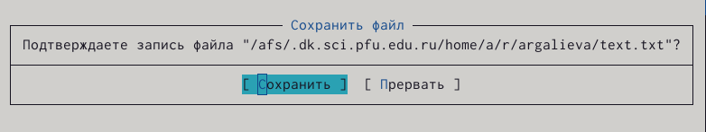{#fig:016 width=70% }

##

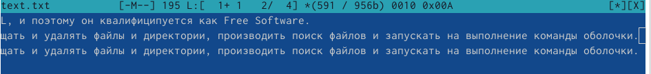{#fig:017 width=70% }

##

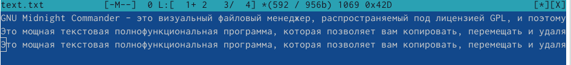{#fig:018 width=70% }

##

{#fig:019 width=70% }

##

7. Открываем файл с исходным текстом на некотором языке программирования.

##

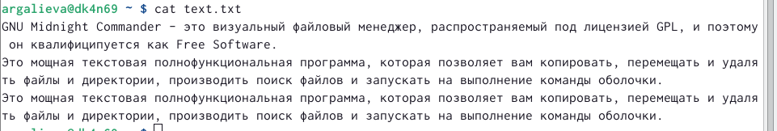{#fig:020 width=70% }

## Результаты

Я освоила основные возможности командной оболочки Midnight Commander. Приобрела навыки практической работы по просмотру каталогов и файлов; манипуляций с ними.

## Итоговый слайд

В ходе выполнения лабораторной работы, я освоила основные возможности командной оболочки Midnight Commander.

