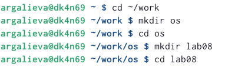
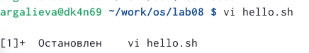
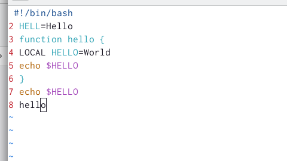
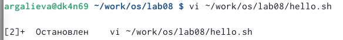
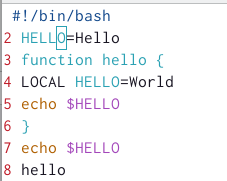
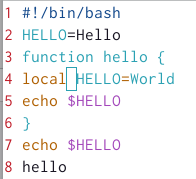
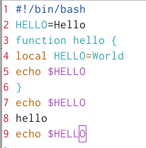
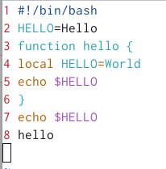
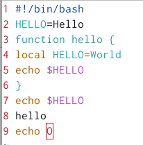

---
## Front matter
lang: ru-RU
title: Лабораторная работа №8
subtitle: Операционные системы
author:
  - Галиева Аделина Руслановна
institute:
  - Российский университет дружбы народов, Москва, Россия
date: 29 марта 2023

## i18n babel
babel-lang: russian
babel-otherlangs: english

## Formatting pdf
toc: false
toc-title: Содержание
slide_level: 2
aspectratio: 169
section-titles: true
theme: metropolis
header-includes:
 - \metroset{progressbar=frametitle,sectionpage=progressbar,numbering=fraction}
 - '\makeatletter'
 - '\beamer@ignorenonframefalse'
 - '\makeatother'
---

## Актуальность

Научиться работать с редактором vi. 

## Цели и задачи

Познакомиться с операционной системой Linux. Получить практические навыки работы с редактором vi, установленным по умолчанию практически во всех дистрибутивах.

## Содержание исследования

1. Создаем каталог с именем ~/work/os/lab08. 

{#fig:001 width=70% }

##

2. Вызываем vi и создаем файл hello.sh.

{#fig:002 width=70% }

##

3. Нажимаем клавишу i и вводим следующий текст. 

{#fig:003 width=70% }

##

4. Нажимаем клавишу Esc для перехода в командный режим после завершения ввода текста. Нажимаем : для перехода в режим последней строки и внизу экрана появляется приглашение в виде двоеточия. Нажимаем w (записать) и q (выйти), а затем нажимаем клавишу Enter для сохранения вашего текста и завершения работы. 

##

{#fig:004 width=70% } 

##

5. Делаем файл исполняемым. 

{#fig:005 width=70% } 

##

6. Вызовем vi на редактирование файла. 

{#fig:006 width=70% } 

##

7. Устанавливаем курсор в конец слова HELL второй строки. Переходим в режим вставки и замените на HELLO. Нажмите Esc для возврата в командный режим. 

##

{#fig:007 width=70% } 

## 

8. Устанавливаем курсор на четвертую строку и стираем слово LOCAL. Переходим в режим вставки и набираем следующий текст: local, нажмите Esc для возврата в командный режим. 

##

{#fig:008 width=70% } 

##

9. Устанавливаем курсор на последней строке файла. Вставляем после неё строку, содержащую следующий текст: echo $HELLO. Нажимаем Esc для перехода в командный режим. Удаляем последнюю строку. 

##

{#fig:009 width=70% } 

##

{#fig:010 width=70% } 

##

10. Вводим команду отмены изменений u для отмены последней команды. 

##

{#fig:011 width=70% } 

##

11. Вводим символ : для перехода в режим последней строки. Записываем произведённые изменения и выйдите из vi. 

{#fig:012 width=70% } 

## Результаты

Я познакомилась с операционной системой Linux. Получила практические навыки работы с редактором vi, установленным по умолчанию практически во всех дистрибутивах.

## Итоговый слайд

В ходе выполнения лабораторной работы, я научилась работать с редактором vi. 

