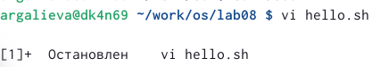
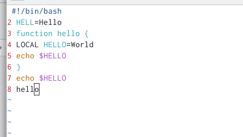
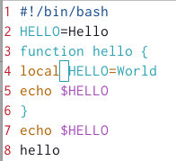
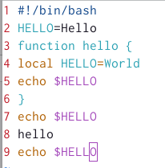

---
## Front matter
title: "Отчёт по лабораторной работе №8"
subtitle: "Текстовой редактор vi"
author: "Галиева Аделина Руслановна"

## Generic otions
lang: ru-RU
toc-title: "Содержание"

## Bibliography
bibliography: bib/cite.bib
csl: pandoc/csl/gost-r-7-0-5-2008-numeric.csl

## Pdf output format
toc: true # Table of contents
toc-depth: 2
lof: true # List of figures
lot: true # List of tables
fontsize: 12pt
linestretch: 1.5
papersize: a4
documentclass: scrreprt
## I18n polyglossia
polyglossia-lang:
  name: russian
  options:
	- spelling=modern
	- babelshorthands=true
polyglossia-otherlangs:
  name: english
## I18n babel
babel-lang: russian
babel-otherlangs: english
## Fonts
mainfont: PT Serif
romanfont: PT Serif
sansfont: PT Sans
monofont: PT Mono
mainfontoptions: Ligatures=TeX
romanfontoptions: Ligatures=TeX
sansfontoptions: Ligatures=TeX,Scale=MatchLowercase
monofontoptions: Scale=MatchLowercase,Scale=0.9
## Biblatex
biblatex: true
biblio-style: "gost-numeric"
biblatexoptions:
  - parentracker=true
  - backend=biber
  - hyperref=auto
  - language=auto
  - autolang=other*
  - citestyle=gost-numeric
## Pandoc-crossref LaTeX customization
figureTitle: "Рис."
tableTitle: "Таблица"
listingTitle: "Листинг"
lofTitle: "Список иллюстраций"
lotTitle: "Список таблиц"
lolTitle: "Листинги"
## Misc options
indent: true
header-includes:
  - \usepackage{indentfirst}
  - \usepackage{float} # keep figures where there are in the text
  - \floatplacement{figure}{H} # keep figures where there are in the text
---

# Цель работы

Познакомиться с операционной системой Linux. Получить практические навыки работы с редактором vi, установленным по умолчанию практически во всех дистрибутивах.

# Выполнение лабораторной работы

1. Создаем каталог с именем ~/work/os/lab08. (рис. @fig:001) 

{#fig:001 width=70% }

2. Вызываем vi и создаем файл hello.sh. (рис. @fig:002) 

{#fig:002 width=70% }

3. Нажимаем клавишу i и вводим следующий текст. (рис. @fig:003)

{#fig:003 width=70% }

4. Нажимаем клавишу Esc для перехода в командный режим после завершения ввода текста. Нажимаем : для перехода в режим последней строки и внизу экрана появляется приглашение в виде двоеточия. Нажимаем w (записать) и q (выйти), а затем нажимаем клавишу Enter для сохранения вашего текста и завершения работы. (рис. @fig:004)

{#fig:004 width=70% } 

5. Делаем файл исполняемым. (рис. @fig:005)

{#fig:005 width=70% } 

6. Вызовем vi на редактирование файла. (рис. @fig:006)

{#fig:006 width=70% } 

7. Устанавливаем курсор в конец слова HELL второй строки. Переходим в режим вставки и замените на HELLO. Нажмите Esc для возврата в командный режим. (рис. @fig:007)

{#fig:007 width=70% } 

8. Устанавливаем курсор на четвертую строку и стираем слово LOCAL. Переходим в режим вставки и набираем следующий текст: local, нажмите Esc для возврата в командный режим. (рис. @fig:008)

{#fig:008 width=70% } 

9. Устанавливаем курсор на последней строке файла. Вставляем после неё строку, содержащую следующий текст: echo $HELLO. Нажимаем Esc для перехода в командный режим. Удаляем последнюю строку. (рис. @fig:009) (рис. @fig:010)

{#fig:009 width=70% } 

{#fig:010 width=70% } 

10. Вводим команду отмены изменений u для отмены последней команды. (рис. @fig:011)

{#fig:011 width=70% } 

11. Вводим символ : для перехода в режим последней строки. Записываем произведённые изменения и выйдите из vi. (рис. @fig:012)

{#fig:012 width=70% } 

# Контрольные вопросы 

1. Дайте краткую характеристику режимам работы редактора vi.
Редактор vi имеет три режима работы: 
a) командный режим — предназначен для ввода команд редактирования и навигации по редактируемому файлу; 
b) режим вставки — предназначен для ввода содержания редактируемого файла; 
c) режим последней (или командной) строки — используется для записи изменений в файл и выхода из редактора.

2. Как выйти из редактора, не сохраняя произведённые изменения?
Ввести в командной строке клавиши q (или q!)

3. . Назовите и дайте краткую характеристику командам позиционирования.
a) 0 (ноль) — переход в начало строки;
b) $ — переход в конец строки; 
c) G — переход в конец файла; 
d) n G — переход на строку с номером n.

4. Что для редактора vi является словом? 
Редактор vi предполагает, что слово - это строка символов, которая может включать в себя буквы, цифры и символы подчеркивания.

5. Каким образом из любого места редактируемого файла перейти в начало (конец) файла?
Каким образом из любого места редактируемого файла перейти в начало (конец) файла?
Здесь нам помогут команды позиционирования. 
a) – G — переход в конец файла; 
b) – 1 G — переход на строку с номером n (В нашем случаи начало файла).
 
6. Назовите и дайте краткую характеристику основным группам команд редактирования.
Команды редактирования имеют девять командных блока: Команды редактирования имеют девять командных блока: Вставка текста, вставка строки, удаление текста, текстовой редактор vi, отмена и повтор произведённых изменений, копирование текста в буфер, вставка текста из буфера, замена текста, поиск текста, 
a) Вставка текста 
– а — вставить текст после курсора; 
– А — вставить текст в конец строки; 
– i — вставить текст перед курсором; 
– n i — вставить текст n раз; 
– I — вставить текст в начало строки. 
b) Вставка строки 
– о — вставить строку под курсором; 
– О — вставить строку над курсором. 
с) Удаление текста 
– x — удалить один символ в буфер; 
– d w — удалить одно слово в буфер; 
– d $ — удалить в буфер текст от курсора до конца строки; 
– d 0 — удалить в буфер текст от начала строки до позиции курсора; 
d) Текстовой редактор vi 
– d d — удалить в буфер одну строку; 
– n d d — удалить в буфер n строк. 
e) Отмена и повтор произведённых изменений
– u — отменить последнее изменение; 
– . — повторить последнее изменение. 
f) Копирование текста в буфер 
– Y — скопировать строку в буфер; 
– n Y — скопировать n строк в буфер; 
– y w — скопировать слово в буфер. 
g) Вставка текста из буфера 
– p — вставить текст из буфера после курсора; 
– P — вставить текст из буфера перед курсором. 
h) Замена текста 
– c w — заменить слово; 
– n c w — заменить n слов; 
– c $ — заменить текст от курсора до конца строки; 
– r — заменить слово; 
– R — заменить текст. 
i) Поиск текста 
– / текст — произвести поиск вперёд по тексту указанной строки символов текст; – ? текст 
— произвести поиск назад по тексту указанной строки символов текст.

7. Необходимо заполнить строку символами $. Каковы ваши действия?
Здесь есть несколько вариантов.
1) Просто заполнять посимвольно строку в режиме редактирования.
2) При помощи команды  – I — вставить текст в начало строки, предварительно его копировав.
3) Вывести из буфера – p — вс ,предварительно удалив или копировав в буфер текст от курсора до конца строки– d $.
4) – c $ — заменить текст от курсора до конца строки;

8. Как отменить некорректное действие, связанное с процессом редактирования?
При помощи блока команд Отмена и повтор произведённых изменений. В нем есть команда: – u — отменить последнее изменение.

9. Назовите и дайте характеристику основным группам команд режима последней строки
Команды редактирования в режиме командной строки имеют три командных блока:
1) Копирование и перемещение текста 
– : n,m d — удалить строки с n по m; 
– : i,j m k — переместить строки с i по j, начиная со строки k; 
– : i,j t k — копировать строки с i по j в строку k; 
– : i,j w имя-файла — записать строки с i по j в файл с именем имя-файла.
2) Запись в файл и выход из редактора 
– : w — записать изменённый текст в файл, не выходя из vi; 
– : w имя-файла — записать изменённый текст в новый файл с именем имя- файла; 
– : w ! имя-файла — записать изменённый текст в файл с именем имя- файла; 
– : w q — записать изменения в файл и выйти из vi; 
– : q — выйти из редактора vi; 
– : q ! — выйти из редактора без записи; 
– : e ! — вернуться в командный режим, отменив все изменения, произве- дённые со времени последней записи 
3) Опции 
Опции редактора vi позволяют настроить рабочую среду. Для задания опций используется команда set (в режиме последней строки): 
– : set all — вывести полный список опций; 
– : set nu — вывести номера строк; 
– : set list — вывести невидимые символы; 
– : set ic — не учитывать при поиске, является ли символ прописным или строчным. Если мы хотим отказаться от использования sat перед именем опции надо поставить no

10. Как определить, не перемещая курсора, позицию, в которой заканчивается строка?
Ввести команду full и символ. После этого вся строка заполнится этим символом, а курсор останется на месте.

11. Выполните анализ опций редактора vi (сколько их, как узнать их назначение и т.д.)
Опции редактора vi позволяют настроить рабочую среду. 
Для задания опций используется команда set (в режиме последней строки): 
– : set all — вывести полный список опций; 
– : set nu — вывести номера строк; 
– : set list — вывести невидимые символы; 
– : set ic — не учитывать при поиске, является ли символ прописным или строчным. Если мы хотим узнать назначение опций, мы должны ввести в консоли man vi set.

12. Как определить режим работы редактора vi?
Если мы находимся в режиме вставки, то внизу экран написано большими буквами: РЕЖИМ ВСТАВКИ переход в него осуществляется при помощи i. 
В командном режиме при нажатии клавиш, с текстом ничего не происходит. Нет внизу экрана  надписи: РЕЖИМ ВСТАВКИ. И отсутствует двоеточие внизу.
Если ввести в командном режиме команду:, то осуществится переход в режим последней строки
В режиме последней строки можно будет вводить такие команды, как wq (записать файл и покинуть редактор vi) или q! (выйти из редактора vi без сохранения изменений). Переход в него можно определить по двоеточию внизу слева.
 
13. Постройте граф взаимосвязи режимов работы редактора vi.
1)Переход осуществляется из A в B при помощи I и ESC обратно.
2)Переход осуществляется из A в C при помощи : и ESC обратно.
3)Переход осуществляется из A в D при помощи ? или / и ESC обратно.
4)Переход осуществляется из A в E при помощи v и ESC обратно.
a) командный режим 
b) режим вставки 
c) режим строки 
d) Режим поиска
e) Визуальный режим

# Выводы

Я познакомилась с операционной системой Linux. Получила практические навыки работы с редактором vi, установленным по умолчанию практически во всех дистрибутивах.

# Список литературы{.unnumbered}

::: {#refs}
:::
