---
## Front matter
lang: ru-RU
title: Лабораторная работа №9
subtitle: Операционные системы
author:
  - Галиева Аделина Руслановна
institute:
  - Российский университет дружбы народов, Москва, Россия
date: 5 апреля 2023

## i18n babel
babel-lang: russian
babel-otherlangs: english

## Formatting pdf
toc: false
toc-title: Содержание
slide_level: 2
aspectratio: 169
section-titles: true
theme: metropolis
header-includes:
 - \metroset{progressbar=frametitle,sectionpage=progressbar,numbering=fraction}
 - '\makeatletter'
 - '\beamer@ignorenonframefalse'
 - '\makeatother'
---

## Актуальность

Научиться работать с текстовым редактором emacs. 

## Цели и задачи

Познакомиться с операционной системой Linux. Получить практические навыки работы с редактором Emacs.

## Содержание исследования

1. Открываем emacs. 

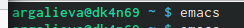{#fig:001 width=70% }

##

2. Создаём файл lab07.sh с помощью комбинации Ctrl-x Ctrl-f (C-x C-f). 

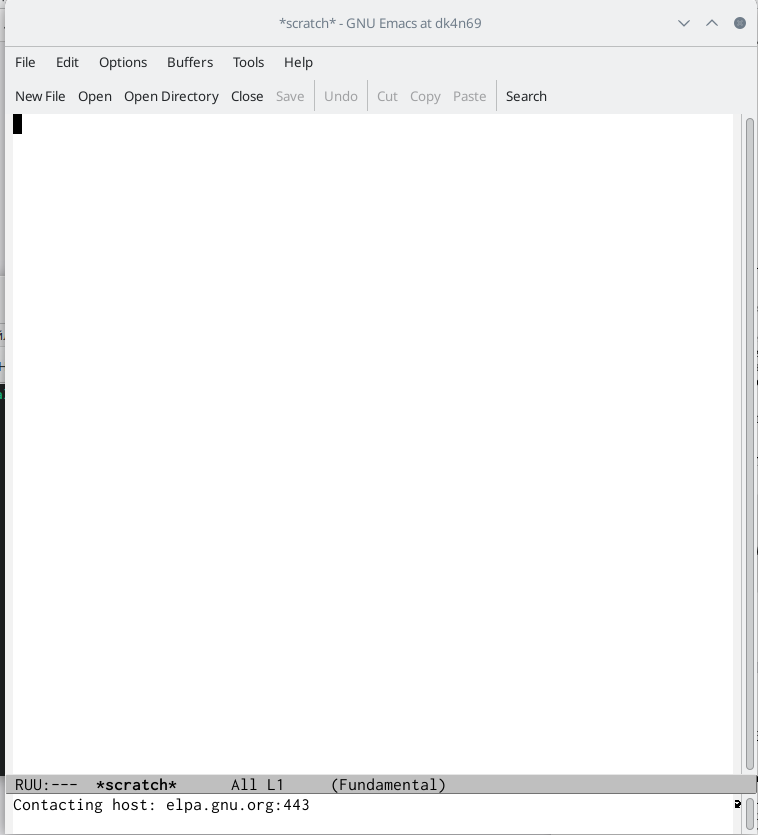{#fig:002 width=70% }

##

3. Набираем текст. 

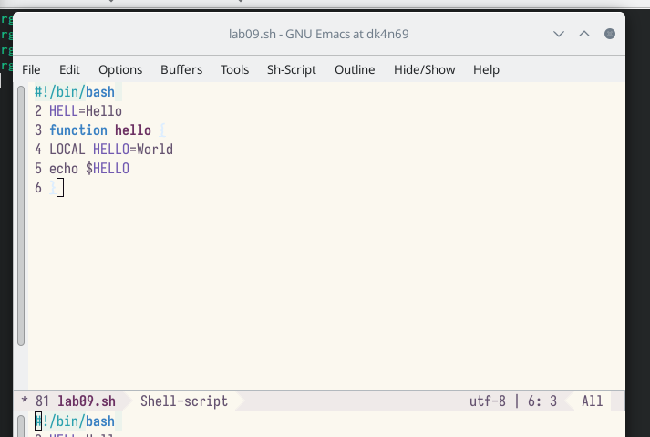{#fig:003 width=70% }

##

4. Сохраняем файл с помощью комбинации Ctrl-x Ctrl-s (C-x C-s). 

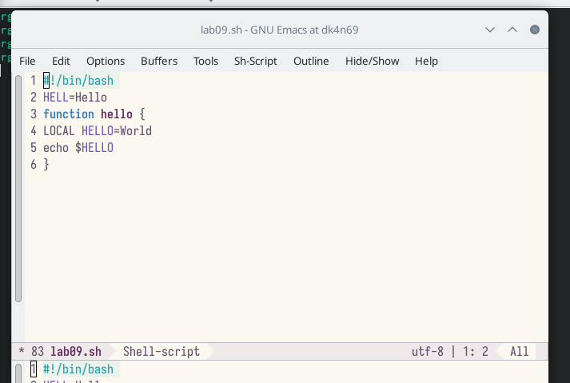{#fig:004 width=70% } 

##

5. Проделываем с текстом стандартные процедуры редактирования, каждое действие должно осуществляться комбинацией клавиш. Вырезаем одной командой целую строку (С-k). Вставляем эту строку в конец файла (C-y). Выделяем область текста (C-space). Копируем область в буфер обмена (M-w). Вставляем область в конец файла. Вновь выделяем эту область и на этот раз вырезать её (C-w). Отменяем последнее действие (C-/). 

##

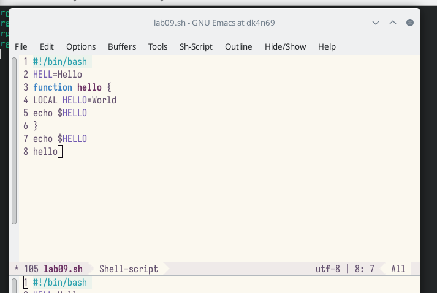{#fig:005 width=70% } 

##

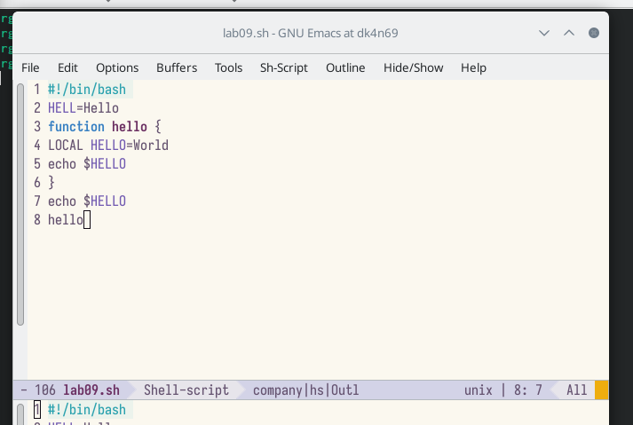{#fig:006 width=70% } 

##

{#fig:007 width=70% } 

##

{#fig:008 width=70% } 

##

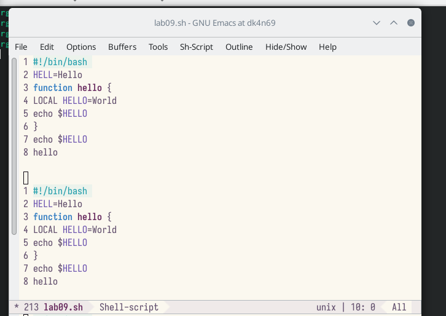{#fig:009 width=70% } 

##

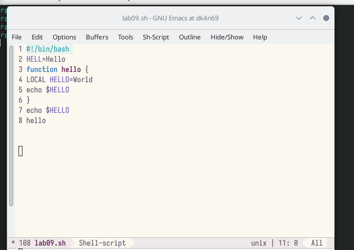{#fig:010 width=70% } 

##

{#fig:011 width=70% } 

##

6. Научимся использовать команды по перемещению курсора. Перемещаем курсор в начало строки (C-a).
Перемещаем курсор в конец строки (C-e). Перемещаем курсор в начало буфера (M-<). Перемещаем курсор в конец буфера (M->). 

##

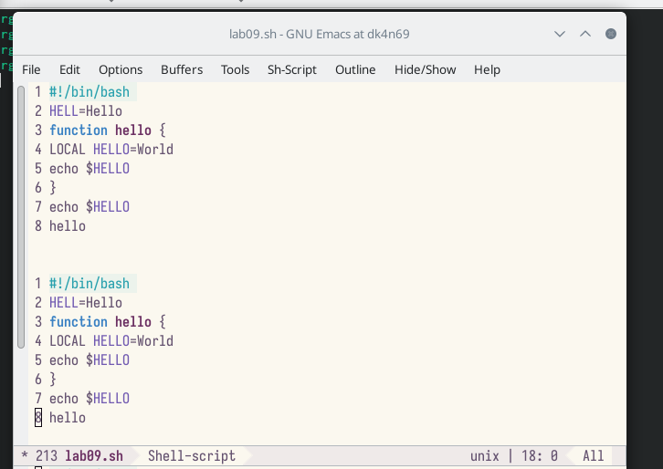{#fig:012 width=70% } 

##

{#fig:013 width=70% } 

##

{#fig:014 width=70% } 

##

{#fig:015 width=70% } 

##

7. Управление буферами. Выводим список активных буферов на экран (C-x C-b). Перемещаем во вновь открытое окно (C-x) o со списком открытых буферов и переключаемся на другой буфер. Закрываем это окно (C-x 0). Теперь вновь переключаемся между буферами, но уже без вывода их списка на
экран (C-x b). 

##

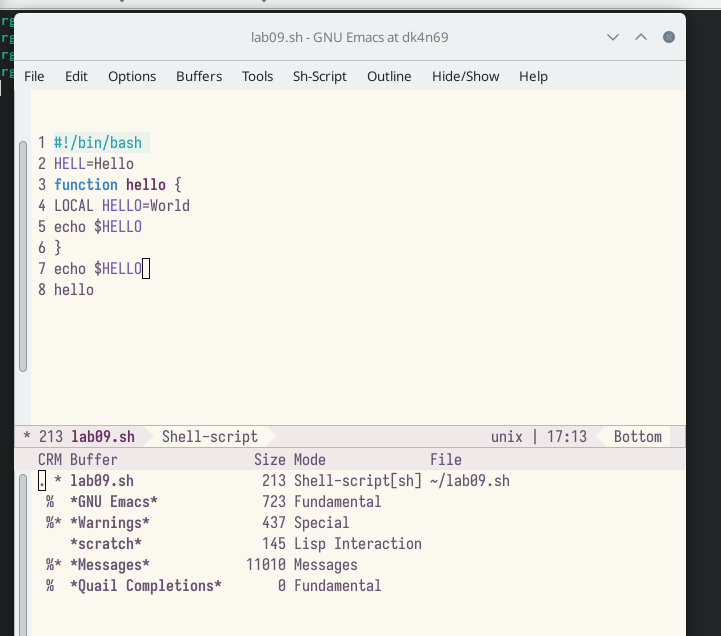{#fig:016 width=70% } 

##

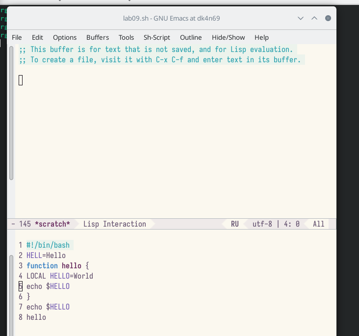{#fig:017 width=70% } 

##

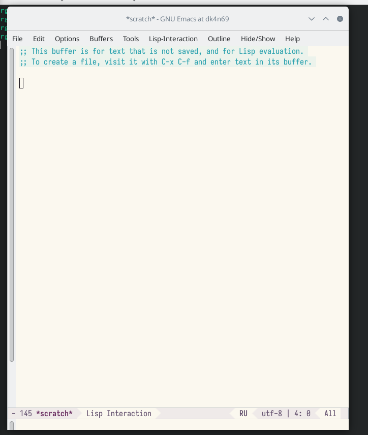{#fig:018 width=70% } 

##

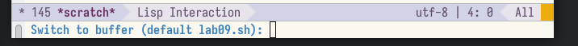{#fig:019 width=70% } 

##

8. Управление окнами. Поделим фрейм на 4 части: разделим фрейм на два окна по вертикали (C-x 3),
а затем каждое из этих окон на две части по горизонтали (C-x 2). В каждом из четырёх созданных окон откроем новый буфер (файл) и введем несколько строк текста. 

##

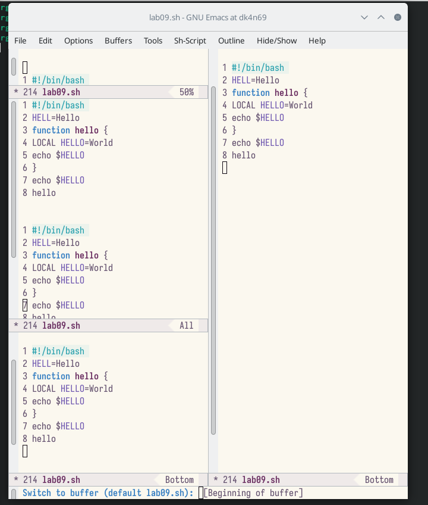{#fig:020 width=70% } 

##

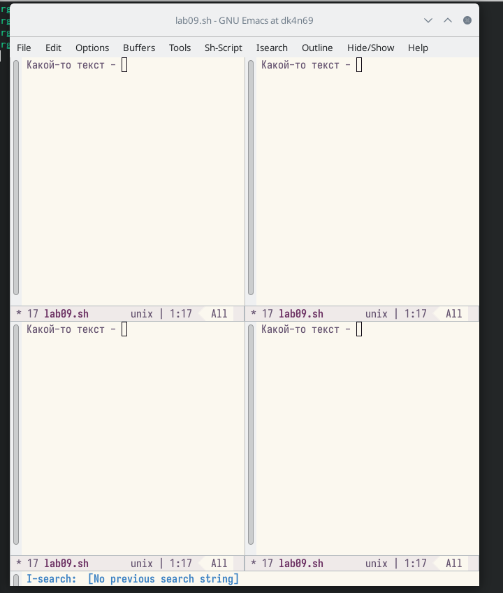{#fig:021 width=70% } 

9. Режим поиска. Переключимся в режим поиска (C-s) и найдем несколько слов, присутствующих в тексте. Переключаемся между результатами поиска, нажимая C-s. Выйдем из режима поиска, нажав C-g. Перейдем в режим поиска и замены (M-%), введем текст, который следует найти и заменить, нажимаем Enter , затем вводим текст для замены. После того как будут подсвечены результаты поиска, нажимаем ! для подтверждения замены. Пробуем другой режим поиска, нажав M-s o. От обычного режима отличается тем, что находит не фраргмент текста, а файл.

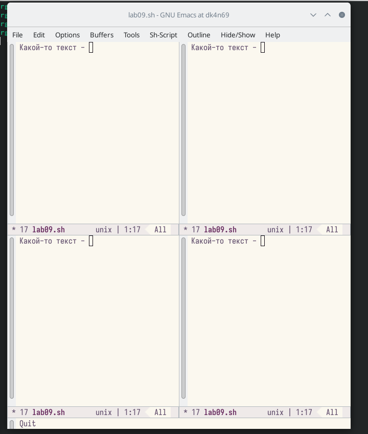{#fig:022 width=70% } 

## Результаты

Я познакомилась с операционной системой Linux. Получила практические навыки работы с редактором Emacs.

## Итоговый слайд

В ходе выполнения лабораторной работы, я научилась работать с текстовым редактором emacs. 

