---
## Front matter
title: "Лабораторная работа №9"
subtitle: "Tекстовой редактор emacs"
author: "Галиева Аделина Руслановна"

## Generic otions
lang: ru-RU
toc-title: "Содержание"

## Bibliography
bibliography: bib/cite.bib
csl: pandoc/csl/gost-r-7-0-5-2008-numeric.csl

## Pdf output format
toc: true # Table of contents
toc-depth: 2
lof: true # List of figures
lot: true # List of tables
fontsize: 12pt
linestretch: 1.5
papersize: a4
documentclass: scrreprt
## I18n polyglossia
polyglossia-lang:
  name: russian
  options:
	- spelling=modern
	- babelshorthands=true
polyglossia-otherlangs:
  name: english
## I18n babel
babel-lang: russian
babel-otherlangs: english
## Fonts
mainfont: PT Serif
romanfont: PT Serif
sansfont: PT Sans
monofont: PT Mono
mainfontoptions: Ligatures=TeX
romanfontoptions: Ligatures=TeX
sansfontoptions: Ligatures=TeX,Scale=MatchLowercase
monofontoptions: Scale=MatchLowercase,Scale=0.9
## Biblatex
biblatex: true
biblio-style: "gost-numeric"
biblatexoptions:
  - parentracker=true
  - backend=biber
  - hyperref=auto
  - language=auto
  - autolang=other*
  - citestyle=gost-numeric
## Pandoc-crossref LaTeX customization
figureTitle: "Рис."
tableTitle: "Таблица"
listingTitle: "Листинг"
lofTitle: "Список иллюстраций"
lotTitle: "Список таблиц"
lolTitle: "Листинги"
## Misc options
indent: true
header-includes:
  - \usepackage{indentfirst}
  - \usepackage{float} # keep figures where there are in the text
  - \floatplacement{figure}{H} # keep figures where there are in the text
---

# Цель работы

Познакомиться с операционной системой Linux. Получить практические навыки работы с редактором Emacs.

# Выполнение лабораторной работы

1. Открываем emacs. (рис. @fig:001) 

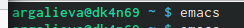{#fig:001 width=70% }

2. Создаём файл lab07.sh с помощью комбинации Ctrl-x Ctrl-f (C-x C-f). (рис. @fig:002) 

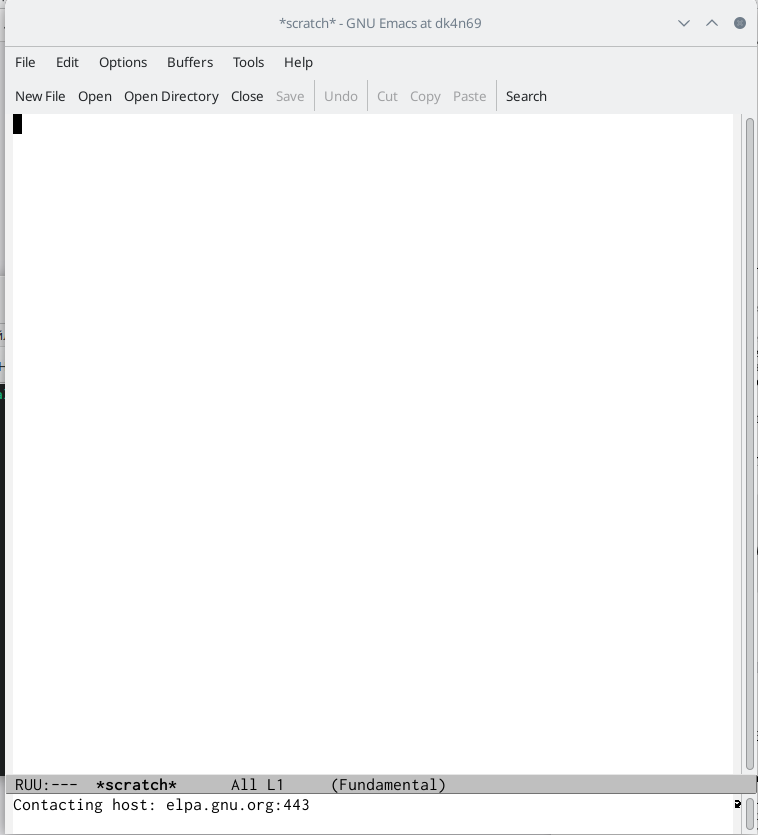{#fig:002 width=70% }

3. Набираем текст. (рис. @fig:003) 

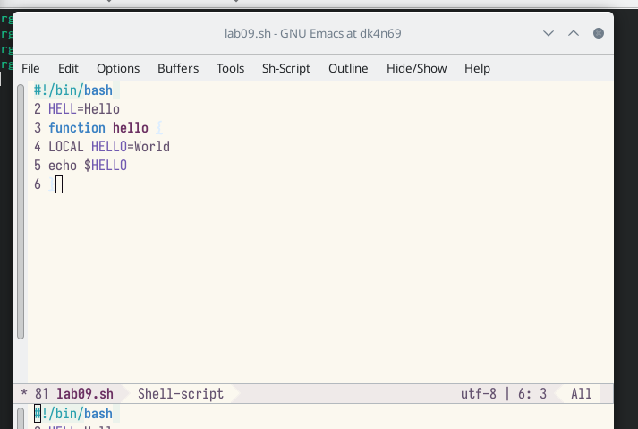{#fig:003 width=70% }

4. Сохраняем файл с помощью комбинации Ctrl-x Ctrl-s (C-x C-s). (рис. @fig:004)

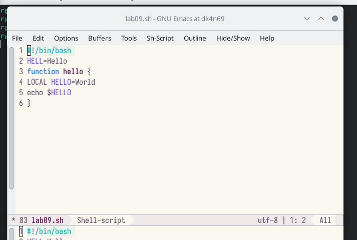{#fig:004 width=70% } 

5. Проделываем с текстом стандартные процедуры редактирования, каждое действие должно осуществляться комбинацией клавиш. Вырезаем одной командой целую строку (С-k). Вставляем эту строку в конец файла (C-y). Выделяем область текста (C-space). Копируем область в буфер обмена (M-w). Вставляем область в конец файла. Вновь выделяем эту область и на этот раз вырезать её (C-w). Отменяем последнее действие (C-/). (рис. @fig:005) (рис. @fig:006) (рис. @fig:007) (рис. @fig:008) (рис. @fig:009) (рис. @fig:010) (рис. @fig:011) 

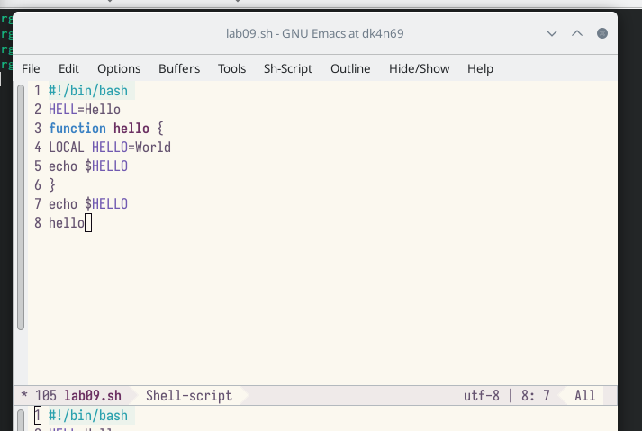{#fig:005 width=70% } 

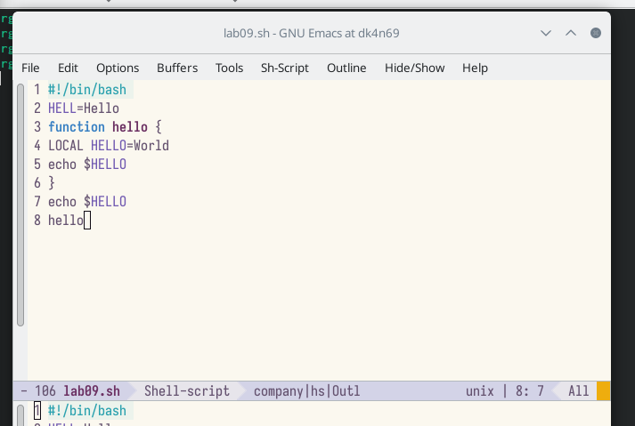{#fig:006 width=70% } 

{#fig:007 width=70% } 

{#fig:008 width=70% } 

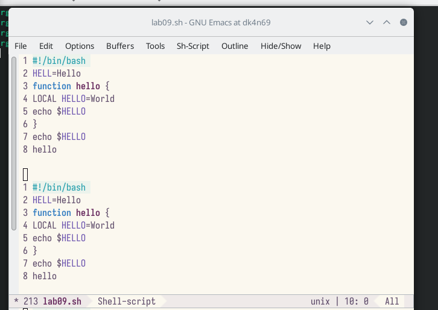{#fig:009 width=70% } 

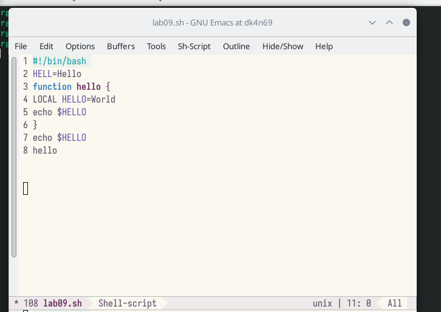{#fig:010 width=70% } 

{#fig:011 width=70% } 

6. Научимся использовать команды по перемещению курсора. Перемещаем курсор в начало строки (C-a).
Перемещаем курсор в конец строки (C-e). Перемещаем курсор в начало буфера (M-<). Перемещаем курсор в конец буфера (M->). (рис. @fig:012) (рис. @fig:013) (рис. @fig:014) (рис. @fig:015) 

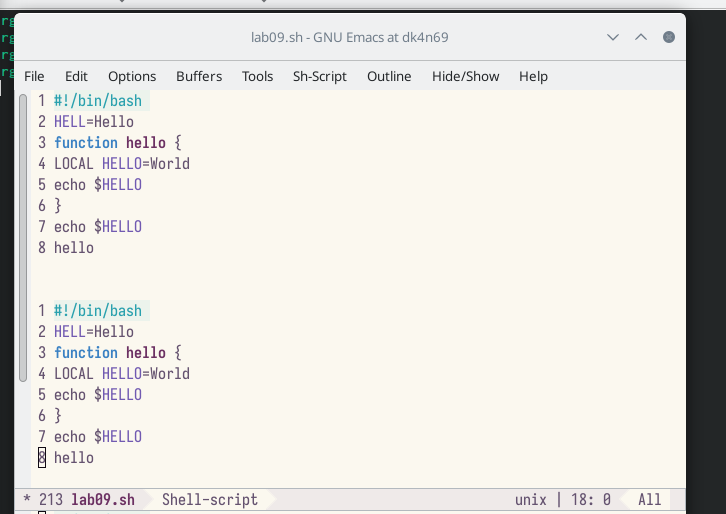{#fig:012 width=70% } 

{#fig:013 width=70% } 

{#fig:014 width=70% } 

{#fig:015 width=70% } 

7. Управление буферами. Выводим список активных буферов на экран (C-x C-b). Перемещаем во вновь открытое окно (C-x) o со списком открытых буферов и переключаемся на другой буфер. Закрываем это окно (C-x 0). Теперь вновь переключаемся между буферами, но уже без вывода их списка на
экран (C-x b). (рис. @fig:016) (рис. @fig:017) (рис. @fig:018) (рис. @fig:019) 

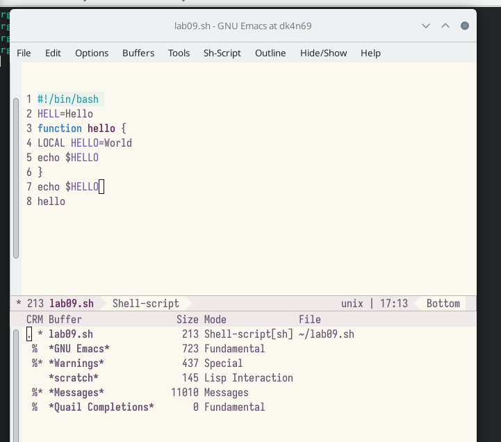{#fig:016 width=70% } 

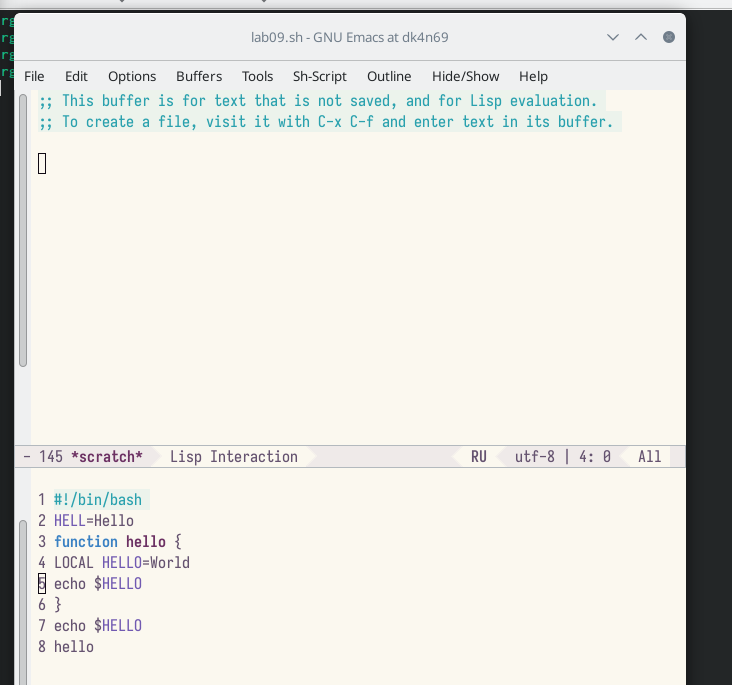{#fig:017 width=70% } 

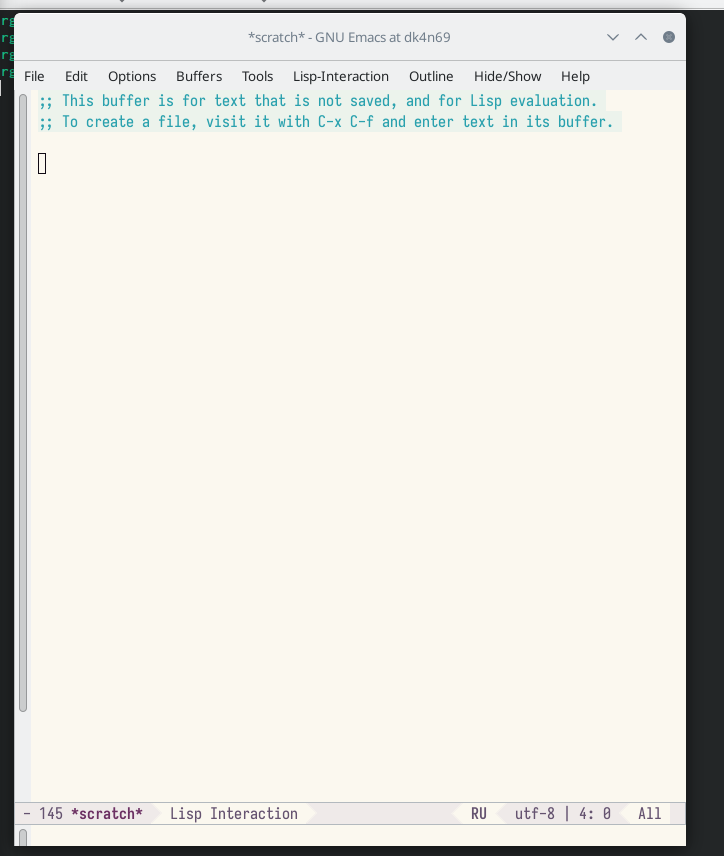{#fig:018 width=70% } 

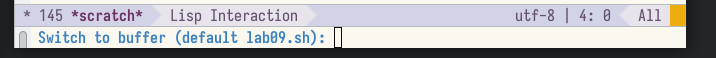{#fig:019 width=70% } 

8. Управление окнами. Поделим фрейм на 4 части: разделим фрейм на два окна по вертикали (C-x 3),
а затем каждое из этих окон на две части по горизонтали (C-x 2). В каждом из четырёх созданных окон откроем новый буфер (файл) и введем несколько строк текста. (рис. @fig:020) (рис. @fig:021) 

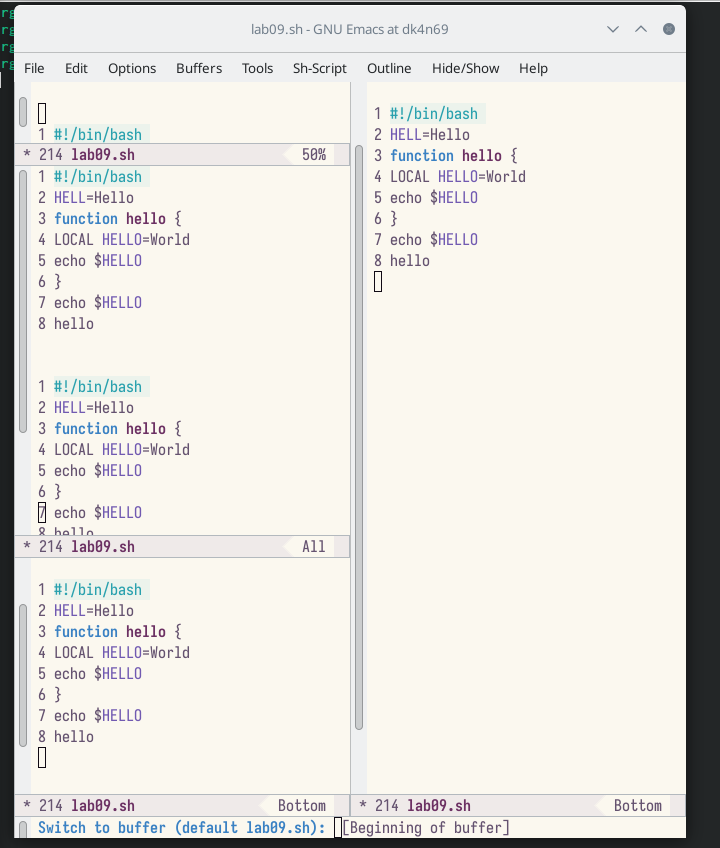{#fig:020 width=70% } 

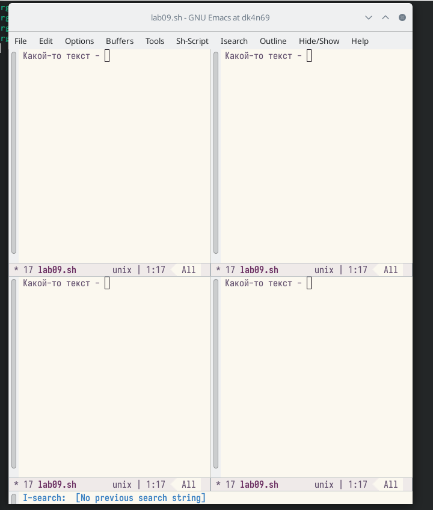{#fig:021 width=70% } 

9. Режим поиска. Переключимся в режим поиска (C-s) и найдем несколько слов, присутствующих в тексте. Переключаемся между результатами поиска, нажимая C-s. Выйдем из режима поиска, нажав C-g. Перейдем в режим поиска и замены (M-%), введем текст, который следует найти и заменить, нажимаем Enter , затем вводим текст для замены. После того как будут подсвечены результаты поиска, нажимаем ! для подтверждения замены. Пробуем другой режим поиска, нажав M-s o. От обычного режима отличается тем, что находит не фраргмент текста, а файл.(рис. @fig:022) 

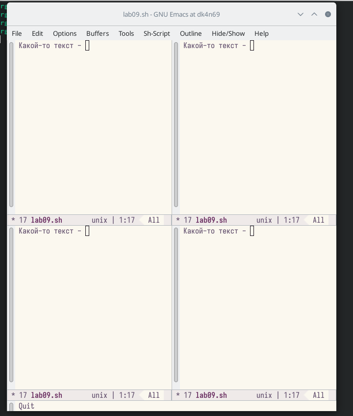{#fig:022 width=70% } 

# Контрольные вопросы

1. Кратко охарактеризуйте редактор emacs. 
Ответ: Emacs представляет собой мощный экранный редактор текста, написанный на языке высокого уровня Elisp. 

2. Какие особенности данного редактора могут сделать его сложным для освоения новичком? 
Ответ: Сложным освоение данной программы для новичка  может сделать незнание комбинации клавиш или английского. 

3. Своими словами опишите, что такое буфер и окно в терминологии emacs’а 
Ответ: Моими словами буфер это динамическая память, а окно- то, что мы видим 

4. Можно ли открыть больше 10 буферов в одном окне? 
Ответ: Можно если нет ограничений на систему. 

5. Какие буферы создаются по умолчанию при запуске emacs? 
Ответ: Буферы, которые открываются по умолчанию: GNU Emacs, scratch, Messages, Quail Completions 

6. Какие клавиши вы нажмёте, чтобы ввести следующую комбинацию C-c | и C-c C-|? 
Ответ: Сtrl+c, Shift+\ и Ctrl+c Ctrl+\ 

7. . Как поделить текущее окно на две части? 
Ответ: Нажать   C-x 3, или  C-x 2. 

8. В каком файле хранятся настройки редактора emacs? 
Ответ: Настройки хранятся в файле ~/.emacs. 

9. Какую функцию выполняет клавиша Backspace и можно ли её переназначить? 
Ответ: Перемещение курсора 

10. Какой редактор вам показался удобнее в работе vi или emacs? Поясните почему. 
Ответ: Редактор emacs ,потому что на нем можно работать сразу с несколькими файлами. 

# Выводы

Я познакомилась с операционной системой Linux. Получила практические навыки работы с редактором Emacs.

# Список литературы{.unnumbered}

::: {#refs}
:::
