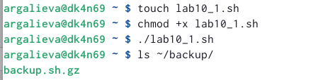
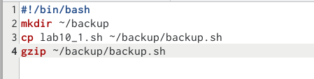
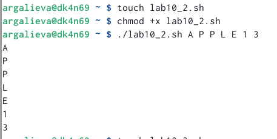
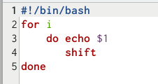
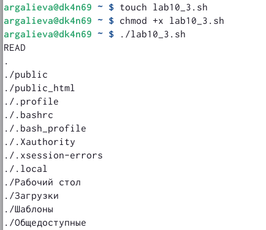
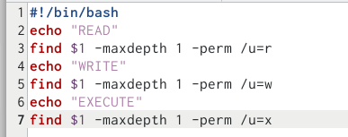
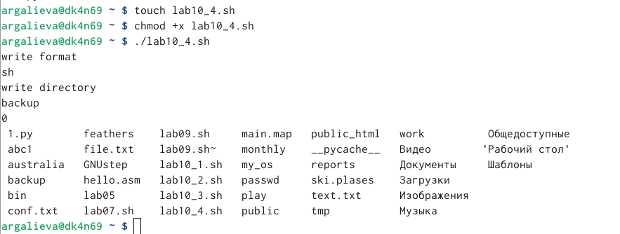
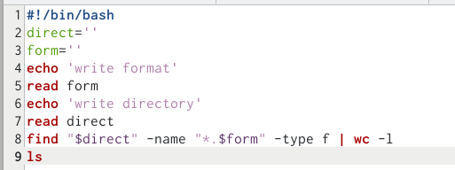

---
## Front matter
lang: ru-RU
title: Лабораторная работа №10
subtitle: Операционные системы
author:
  - Галиева Аделина Руслановна
institute:
  - Российский университет дружбы народов, Москва, Россия
date: 12 апреля 2023

## i18n babel
babel-lang: russian
babel-otherlangs: english

## Formatting pdf
toc: false
toc-title: Содержание
slide_level: 2
aspectratio: 169
section-titles: true
theme: metropolis
header-includes:
 - \metroset{progressbar=frametitle,sectionpage=progressbar,numbering=fraction}
 - '\makeatletter'
 - '\beamer@ignorenonframefalse'
 - '\makeatother'
---

## Актуальность

Научиться писать небольшие командные файлы.

## Цели и задачи

Изучить основы программирования в оболочке ОС UNIX/Linux. Научиться писать небольшие командные файлы.

## Содержание исследования

1. Пишем скрипт, который при запуске будет делать резервную копию самого себя (то есть файла, в котором содержится его исходный код) в другую директорию backup в нашем домашнем каталоге.

##

{#fig:001 width=70% }

##

{#fig:002 width=70% }

##

2. Пишем пример командного файла, обрабатывающего любое произвольное число аргументов командной строки, в том числе превышающее десять.

##

{#fig:003 width=70% }

##

{#fig:004 width=70% }

##

3. Пишем командный файл — аналог команды ls (без использования самой этой команды и команды dir). 

##

{#fig:005 width=70% }

##

{#fig:006 width=70% }

##

4. Пишем командный файл, который получает в качестве аргумента командной строки формат файла (.txt, .doc, .jpg, .pdf и т.д.) и вычисляет количество таких файлов в указанной директории. Путь к директории также передаётся в виде аргумента командной строки.

##

{#fig:007 width=70% }

##

{#fig:008 width=70% }

## Результаты

Я изучила основы программирования в оболочке ОС UNIX/Linux. Научилась писать небольшие командные файлы.

## Итоговый слайд

В ходе выполнения лабораторной работы, я научилась писать небольшие командные файлы.

