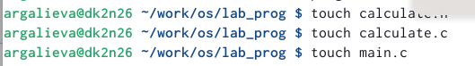
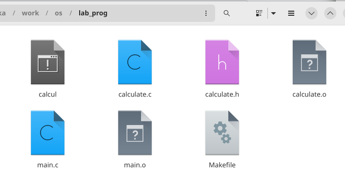
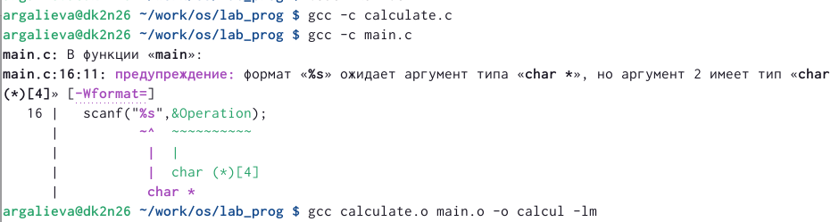
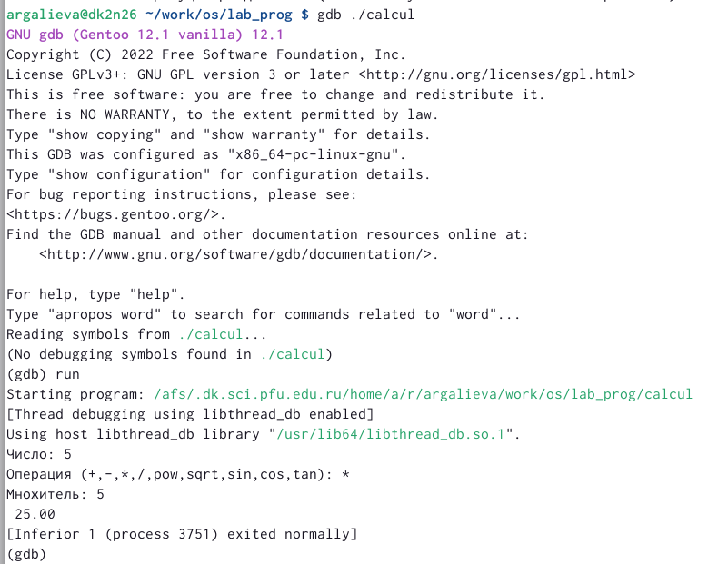
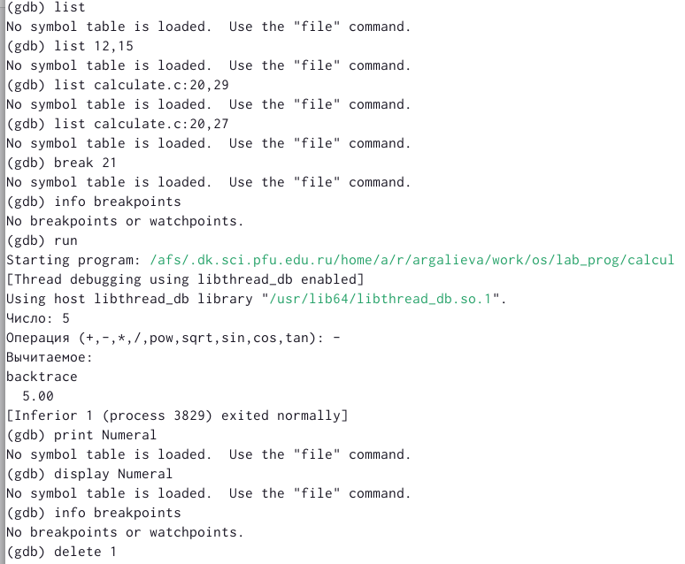
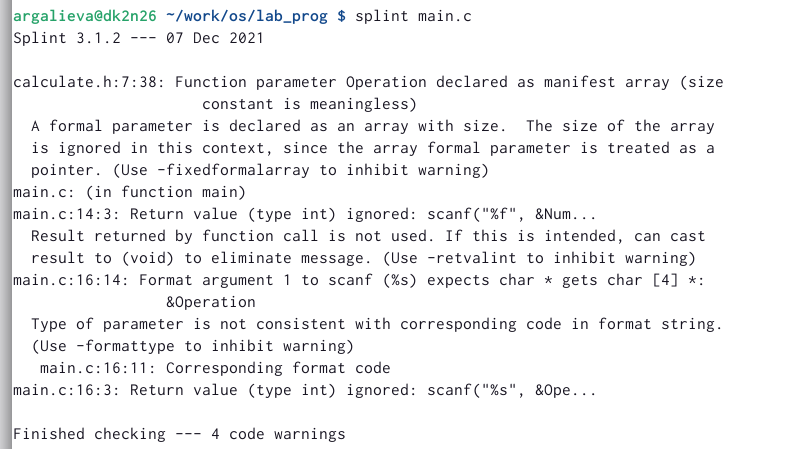
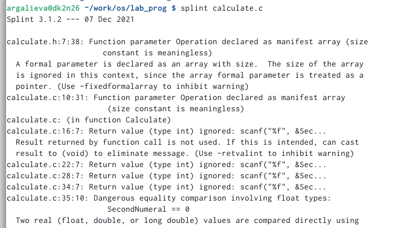

---
## Front matter
lang: ru-RU
title: "Лабораторная работа №13"
subtitle: "Средства, применяемые при разработке программного обеспечения в ОС типа UNIX/Linux"
author:
  - Галиева Аделина Руслановна
institute:
  - Российский университет дружбы народов, Москва, Россия
date: 3 мая 2023

## i18n babel
babel-lang: russian
babel-otherlangs: english

## Formatting pdf
toc: false
toc-title: Содержание
slide_level: 2
aspectratio: 169
section-titles: true
theme: metropolis
header-includes:
 - \metroset{progressbar=frametitle,sectionpage=progressbar,numbering=fraction}
 - '\makeatletter'
 - '\beamer@ignorenonframefalse'
 - '\makeatother'
---

## Цели и задачи

Приобрести простейшие навыки разработки, анализа, тестирования и отладки приложений в ОС типа UNIX/Linux на примере создания на языке программирования. С калькулятора с простейшими функциями.

## Содержание исследования

1. В домашнем каталоге создаём подкаталог ~/work/os/lab_prog.

{#fig:001 width=70% }

##

2. Создаём в нём файлы: calculate.h, calculate.c, main.c. 

{#fig:002 width=70% }

##

{#fig:003 width=70% }

##

3. Выполняем компиляцию программы посредством gcc. 

{#fig:004 width=70% }

##

4. С помощью gdb выполняем отладку программы calcul (перед использованием gdb исправили Makefile). 

##

{#fig:005 width=70% }

##

{#fig:006 width=70% }

##

5. С помощью утилиты splint анализируем коды файлов calculate.c и main.c. 

##

{#fig:007 width=70% }

##

{#fig:008 width=70% }

## Результаты

Я приобрела простейшие навыки разработки, анализа, тестирования и отладки приложений в ОС типа UNIX/Linux на примере создания на языке программирования. С калькулятора с простейшими функциями.

