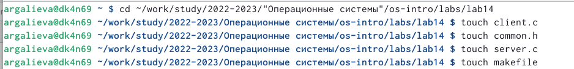
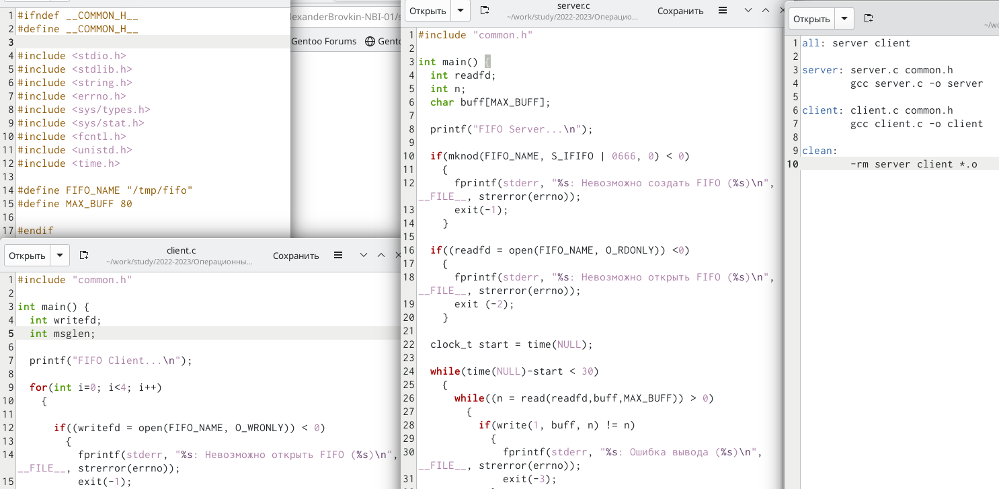

---
## Front matter
lang: ru-RU
title: Лабораторная работа №14
subtitle: Именованные каналы
author:
  - Бекназарова Виктория Тиграновна
institute:
  - Российский университет дружбы народов, Москва, Россия
date: 10 мая 2023

## i18n babel
babel-lang: russian
babel-otherlangs: english

## Formatting pdf
toc: false
toc-title: Содержание
slide_level: 2
aspectratio: 169
section-titles: true
theme: metropolis
header-includes:
 - \metroset{progressbar=frametitle,sectionpage=progressbar,numbering=fraction}
 - '\makeatletter'
 - '\beamer@ignorenonframefalse'
 - '\makeatother'
---

## Цели и задачи

Приобретение практических навыков работы с именованными каналами.

## Содержание исследования

Пишем и редактируем программы на С, так чтобы на одном сервере можно было запускать сначала один клиент.
Далее напишем и отредактируем программы, так чтобы на одном сервере можно было запускать больше серверов, чем один, интервал между клиентами будет 5 секунд, сервер завершится через 30 секунд.
Мы имеем 4 файла (программы) это заголовочный файл (common.h) клиент (client.c), сервер (server.c), и Makefile. 

{#fig:001 width=70%}

##

{#fig:002 width=70%}

## Результаты

Я приобрела практические навыки работы с именованными каналами.

