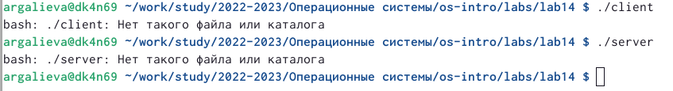

---
## Front matter
lang: ru-RU
title: "Лабораторная работа №14"
subtitle: "Именованные каналы"
author:
  - Галиева Аделина Руслановна
institute:
  - Российский университет дружбы народов, Москва, Россия
date: 10 мая 2023

## i18n babel
babel-lang: russian
babel-otherlangs: english

## Formatting pdf
toc: false
toc-title: Содержание
slide_level: 2
aspectratio: 169
section-titles: true
theme: metropolis
header-includes:
 - \metroset{progressbar=frametitle,sectionpage=progressbar,numbering=fraction}
 - '\makeatletter'
 - '\beamer@ignorenonframefalse'
 - '\makeatother'
---

## Цели и задачи

Приобретение практических навыков работы с именованными каналами.

## Содержание исследования

1. Создаем необходимые нам файлы.

{#fig:001 width=70% }

##

2. Прописываем в созданных файлах программы. 

{#fig:002 width=70% }

##

3. После написания кодов, я, используя команду «make all», скомпилировала необходимые файлы
Далее я проверила работу написанного кода. Отрыла 3 консоли (терминала) и запустила: в первом терминале − «./server», в остальных двух – «./client». В результате каждый терминал-клиент вывел по 4 сообщения. Спустя 30 секунд работа сервера была прекращена. 

{#fig:003 width=70% }

## Результаты

Я приобрела практические навыки работы с именованнымми каналами. 

