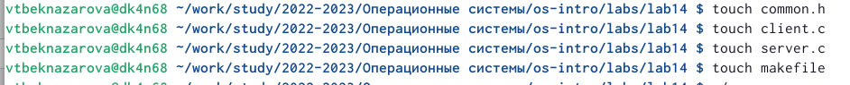
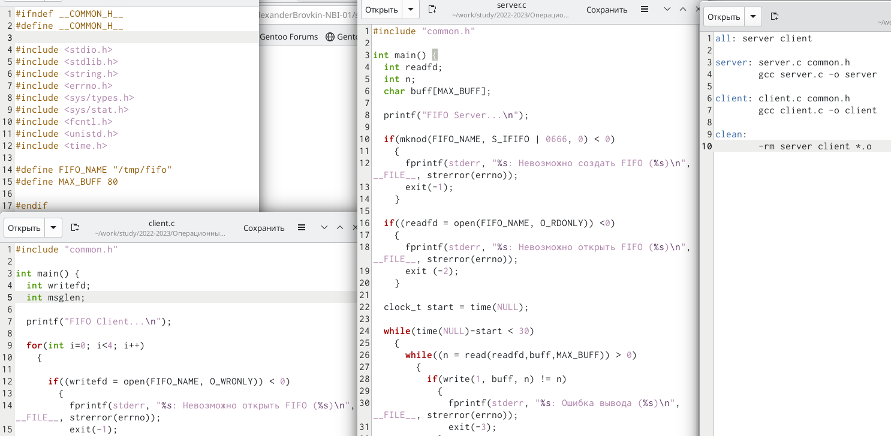

---
## Front matter
title: "Лабораторная работа №14"
subtitle: "Именованные каналы"
author: "Бекназарова Виктория Тиграновна"


## Generic otions
lang: ru-RU
toc-title: "Содержание"

## Bibliography
bibliography: bib/cite.bib
csl: pandoc/csl/gost-r-7-0-5-2008-numeric.csl

## Pdf output format
toc: true # Table of contents
toc-depth: 2
lof: true # List of figures
lot: true # List of tables
fontsize: 12pt
linestretch: 1.5
papersize: a4
documentclass: scrreprt
## I18n polyglossia
polyglossia-lang:
  name: russian
  options:
	- spelling=modern
	- babelshorthands=true
polyglossia-otherlangs:
  name: english
## I18n babel
babel-lang: russian
babel-otherlangs: english
## Fonts
mainfont: PT Serif
romanfont: PT Serif
sansfont: PT Sans
monofont: PT Mono
mainfontoptions: Ligatures=TeX
romanfontoptions: Ligatures=TeX
sansfontoptions: Ligatures=TeX,Scale=MatchLowercase
monofontoptions: Scale=MatchLowercase,Scale=0.9
## Biblatex
biblatex: true
biblio-style: "gost-numeric"
biblatexoptions:
  - parentracker=true
  - backend=biber
  - hyperref=auto
  - language=auto
  - autolang=other*
  - citestyle=gost-numeric
## Pandoc-crossref LaTeX customization
figureTitle: "Рис."
tableTitle: "Таблица"
listingTitle: "Листинг"
lofTitle: "Список иллюстраций"
lotTitle: "Список таблиц"
lolTitle: "Листинги"
## Misc options
indent: true
header-includes:
  - \usepackage{indentfirst}
  - \usepackage{float} # keep figures where there are in the text
  - \floatplacement{figure}{H} # keep figures where there are in the text
---

# Цель работы

Приобретение практических навыков работы с именованными каналами.


# Выполнение лабораторной работы

Пишем и редактируем программы на С, так чтобы на одном сервере можно было запускать сначала один клиент.
Далее напишем и отредактируем программы, так чтобы на одном сервере можно было запускать больше серверов, чем один, интервал между клиентами будет 5 секунд, сервер завершится через 30 секунд.
Мы имеем 4 файла (программы) это заголовочный файл (common.h) клиент (client.c), сервер (server.c), и Makefile. (рис. @fig:001).(рис. @fig:002).

{#fig:001 width=70%}


{#fig:002 width=70%}

# Выводы

Я приобрела практические навыки работы с именованными каналами.


# Контрольные вопросы

1. В чем ключевое отличие именованных каналов от неименованных?
Ответ: У именованных каналов есть идентификатора канала, а у неименованных его нет.

2. Возможно ли создание неименованного канала из командной строки?
Ответ: Возможно создание неименованного канала из командной строки, но только с созданием временного канала с индикатором.

3. Возможно ли создание именованного канала из командной строки?
Ответ: Да. При помощи mknod.

4. Опишите функцию языка С, создающую неименованный канал.
Ответ:
```
#include int fd[2]; 
pipe(fd); 
/* возвращает 0 в случае успешного завершения, -1 - в случае ошибки;*/ 
Это значит, что функция возвращает два файловых дескриптора: fd[0] и fd[l], при этом первый открыт для чтения, а второй – для записи.
```

5. Опишите функцию языка С, создающую именованный канал.
Ответ: 
```
#include <sys/types.h> 
#include <sys/stat.h> 
int mkfifo(const char *pathname, mode_t mode);
```

6. . Что будет в случае прочтения из fifo меньшего числа байтов, чем находится в канале? Большего числа байтов?
Ответ: 
При чтении меньшего числа байтов, чем находится в канале или FIFO, возвращается требуемое число байтов, остаток сохраняется для последующих чтений. При чтении большего числа байтов, чем находится в канале или FIFO, возвращается доступное число байтов. Процесс, читающий из канала, должен соответствующим образом обработать ситуацию, когда прочитано меньше, чем требуется в программе.

7. Аналогично, что будет в случае записи в fifo меньшего числа байтов, чем позволяет буфер? Большего числа байтов?
Ответ: Запись числа байтов, меньшего числа битов у канала или FIFO, в случае, когда несколько процессов одновременно записывают в канал, порции данных от этих процессов не перемешиваются. При записи большего числа байтов, чем это позволяет канал или FIFO, вызов write(2) блокируется до освобождения занятой нами до этого памяти.

8. Могут ли два и более процессов читать или записывать в канал?
Ответ: Да. Если у buff достаточное количество памяти.

9. Опишите функцию write (тип возвращаемого значения, аргументы и логику работы). Что означает 1 (единица) в вызове этой функции в программе server.c (строка 42)?
Ответ: Функция записывает length памяти из буфера buffer в файл, определенный дескриптором файла fd. Эта операция чисто 'двоичная' и без буферизации. При единице возвращает действительное число байтов. При  -1 сообщение об ошибке.

10.  Опишите функцию strerror
Ответ: Интерпретирует номер ошибки, передаваемый в функцию в качестве аргумента — errornum, в понятное для человека текстовое сообщение (строку). Откуда берутся эти ошибки? Ошибки эти возникают при вызове функций стандартных Си-библиотек. То есть хорошим тоном программирования будет — использование этой функции в паре с другой, и если возникнет ошибка, то пользователь или программист поймет, как исправить ошибку, прочитав сообщение функции strerror.
Возвращенный указатель ссылается на статическую строку с ошибкой, которая не должна быть изменена программой. Дальнейшие вызовы функции strerror перезапишут содержание этой строки. Интерпретированные сообщения об ошибках могут различаться, это зависит от платформы и компилятора.
