---
## Front matter
lang: ru-RU
title: "Индивидуальный проект"
subtitle: "Операционные системы"
author:
  - Галиева Аделина Руслановна
institute:
  - Российский университет дружбы народов, Москва, Россия
date: 25 февраля 2023

## i18n babel
babel-lang: russian
babel-otherlangs: english

## Formatting pdf
toc: false
toc-title: Содержание
slide_level: 2
aspectratio: 169
section-titles: true
theme: metropolis
header-includes:
 - \metroset{progressbar=frametitle,sectionpage=progressbar,numbering=fraction}
 - '\makeatletter'
 - '\beamer@ignorenonframefalse'
 - '\makeatother'
---

## Актуальность

Научиться создавать личный сайт.

## Цели и задачи

Создать первоначальный шаблон индвидуального сайта и сделать основную настройку репозиториев. 

## Содержание исследования

1. Скачиваем архив hugo, который подходит вашей ОС, создаём папку bin и переносим файл hugo в созданную папку(bin) 

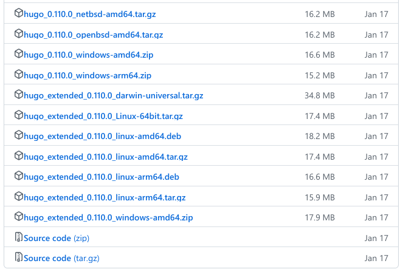{#fig:001 width=70%}

##

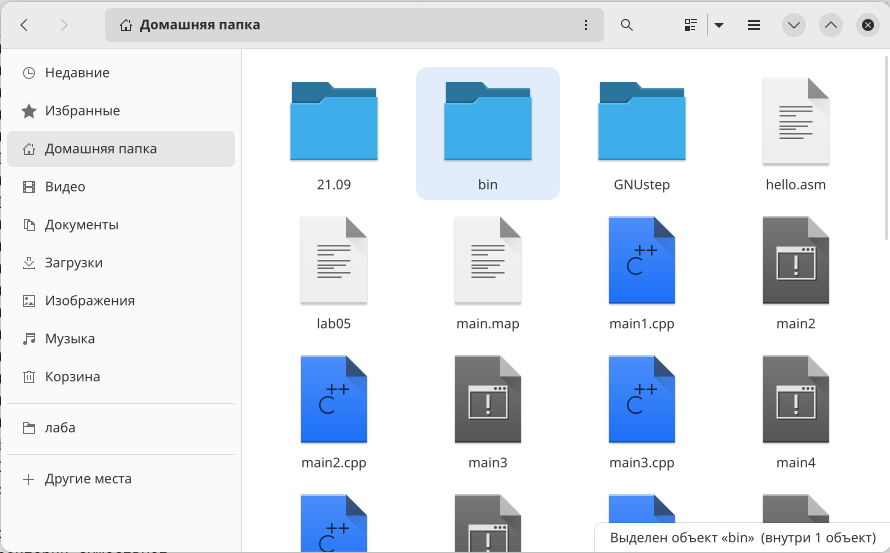{#fig:002 width=70%}

##

2. Создаём репозиторий на основе шаблона в ТУИС

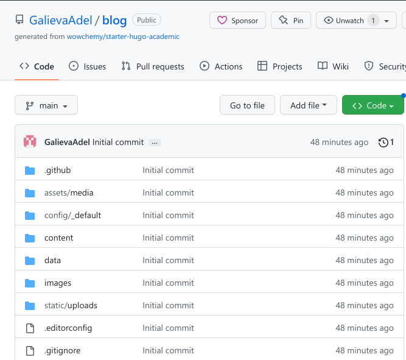{#fig:003 width=70%}

##

3. Клонируем шаблонный репозиторий в личный репозиторий при помощи команды git clone 

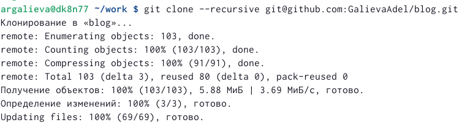{#fig:004 width=70%}

##

4. Смотрим каталоги ~/bin/hugo и при помощи команды ~/bin/hugo server получаем ссылку на шаблон сайта 

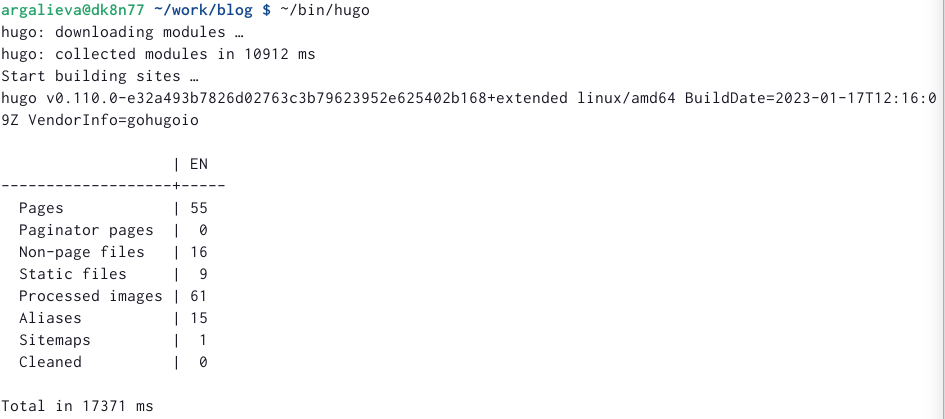{#fig:005 width=70%}

##

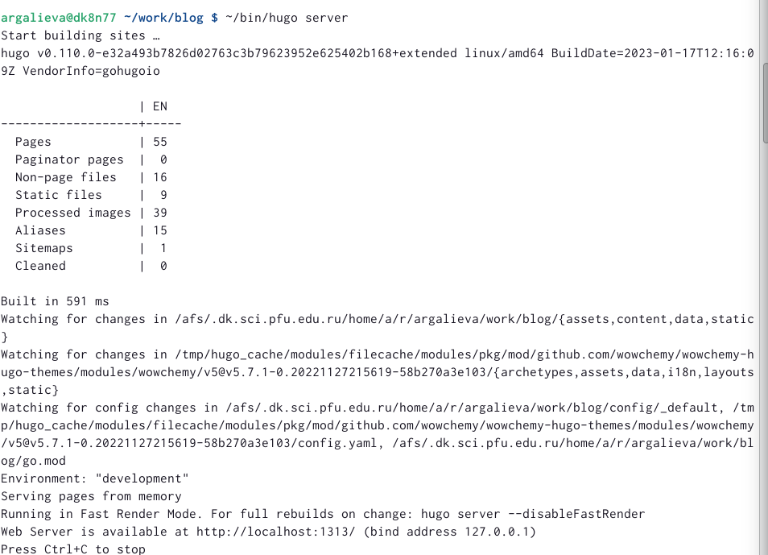{#fig:006 width=70%}

##

5. Создаем еще один репозиторий, чтобы сайт можно было открыть с любого ПК 

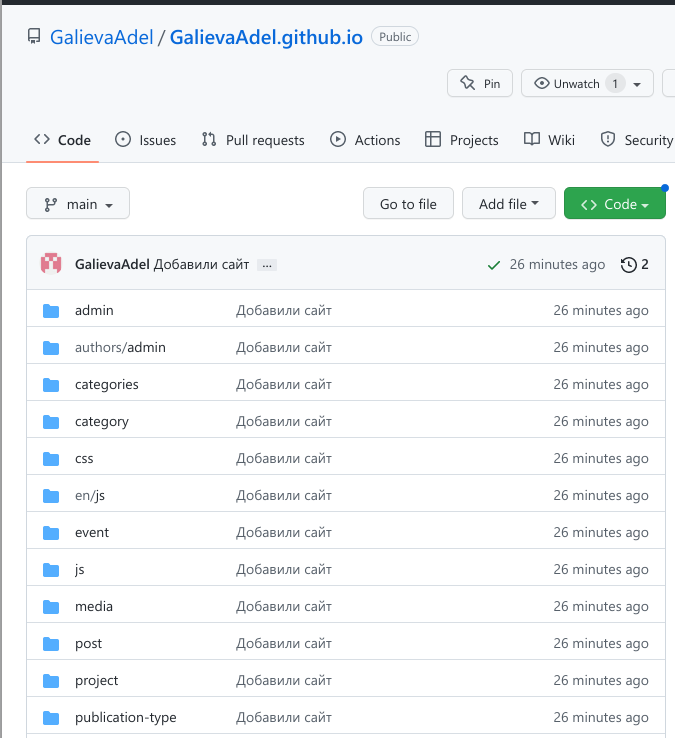{#fig:007 width=70%}

##

6. Клонируем новый созданный репозиторий, переключаемся на ветку main, создаём файл md и выгружаем на github 

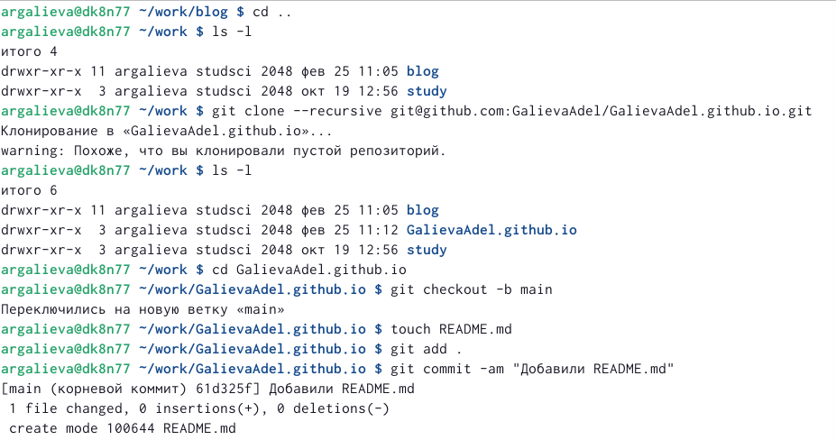{#fig:008 width=70%}

##

7. Переносим всю полученную информацию на основную ветку с помощию команды git push origin main, добавляем новые подкаталоги на github, восстанавливаем папку public 

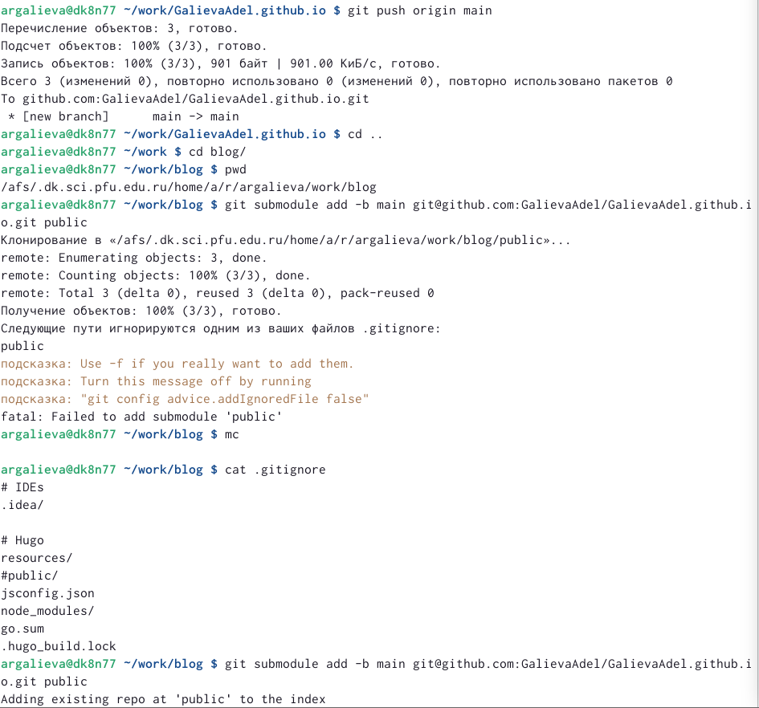{#fig:009 width=70%}

##

8. Проверяем привязку двух репозиториев к github и обновляем репозиторий 

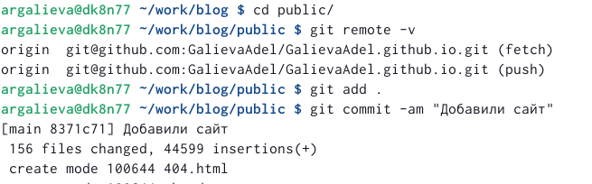{#fig:010 width=70%}

##

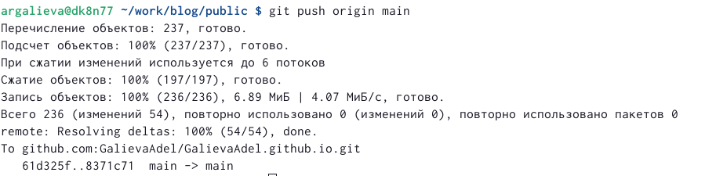{#fig:011 width=70%}

##

9. Заходим на личный сайт 

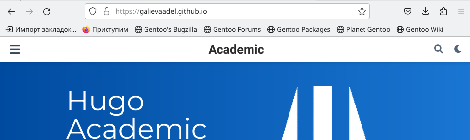{#fig:0012 width=70%}

## Результаты

Выполнили первый шаг к созданию личного сайта.

## Итоговый слайд

В ходе выполения лабораторной работы, я создала шаблон для личного сайта и создала первоначальную настройку шаблона. 

