---
## Front matter
title: "Индивидуальный проект"
subtitle: "Первый этап"
author: "Галиева Аделина Руслановна"

## Generic otions
lang: ru-RU
toc-title: "Содержание"

## Bibliography
bibliography: bib/cite.bib
csl: pandoc/csl/gost-r-7-0-5-2008-numeric.csl

## Pdf output format
toc: true # Table of contents
toc-depth: 2
lof: true # List of figures
lot: true # List of tables
fontsize: 12pt
linestretch: 1.5
papersize: a4
documentclass: scrreprt
## I18n polyglossia
polyglossia-lang:
  name: russian
  options:
	- spelling=modern
	- babelshorthands=true
polyglossia-otherlangs:
  name: english
## I18n babel
babel-lang: russian
babel-otherlangs: english
## Fonts
mainfont: PT Serif
romanfont: PT Serif
sansfont: PT Sans
monofont: PT Mono
mainfontoptions: Ligatures=TeX
romanfontoptions: Ligatures=TeX
sansfontoptions: Ligatures=TeX,Scale=MatchLowercase
monofontoptions: Scale=MatchLowercase,Scale=0.9
## Biblatex
biblatex: true
biblio-style: "gost-numeric"
biblatexoptions:
  - parentracker=true
  - backend=biber
  - hyperref=auto
  - language=auto
  - autolang=other*
  - citestyle=gost-numeric
## Pandoc-crossref LaTeX customization
figureTitle: "Рис."
tableTitle: "Таблица"
listingTitle: "Листинг"
lofTitle: "Список иллюстраций"
lotTitle: "Список таблиц"
lolTitle: "Листинги"
## Misc options
indent: true
header-includes:
  - \usepackage{indentfirst}
  - \usepackage{float} # keep figures where there are in the text
  - \floatplacement{figure}{H} # keep figures where there are in the text
---

# Цель работы

Создать первоначальный шаблон индвидуального сайта и сделать основную настройку репозиториев. 

# Выполнение лабораторной работы

1. Скачиваем архив hugo, который подходит вашей ОС, создаём папку bin и переносим файл hugo в созданную папку(bin) (рис. @fig:001) (рис. @fig:002)

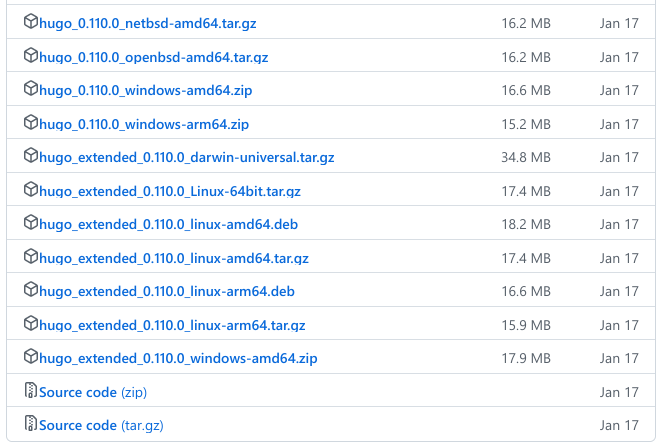{#fig:001 width=70%}

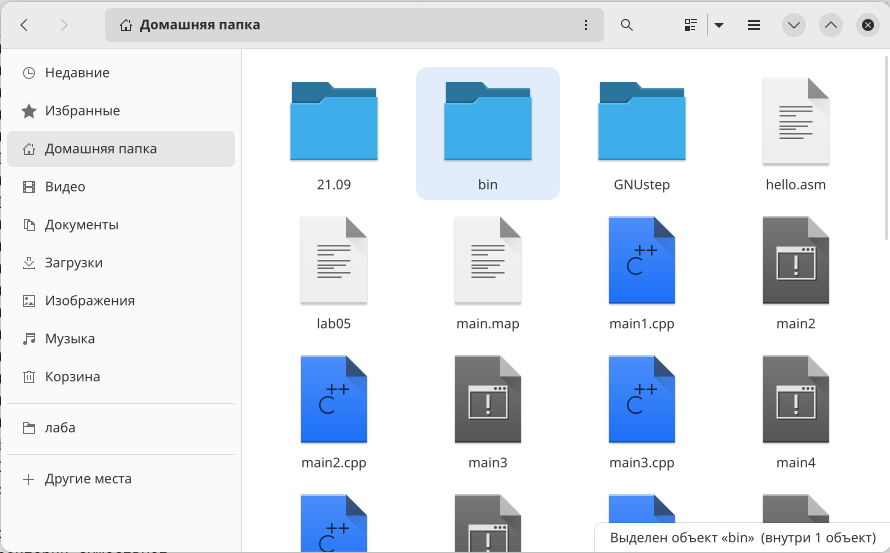{#fig:002 width=70%}

2. Создаём репозиторий на основе шаблона в ТУИС. (рис. @fig:003)

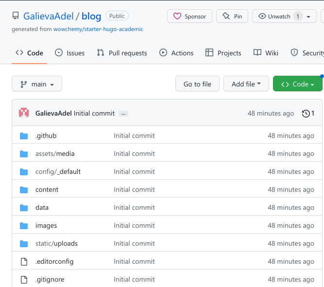{#fig:003 width=70%}

3. Клонируем шаблонный репозиторий в личный репозиторий при помощи команды git clone (рис. @fig:004)

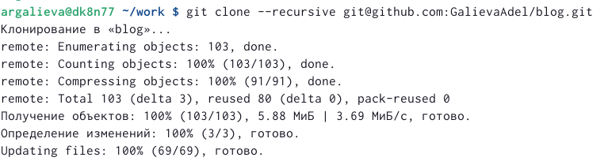{#fig:004 width=70%}

4. Смотрим каталоги ~/bin/hugo и при помощи команды ~/bin/hugo server получаем ссылку на шаблон сайта (рис. @fig:005) (рис. @fig:006)

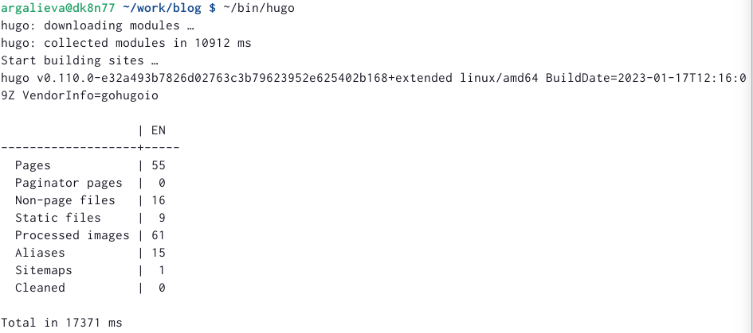{#fig:005 width=70%}

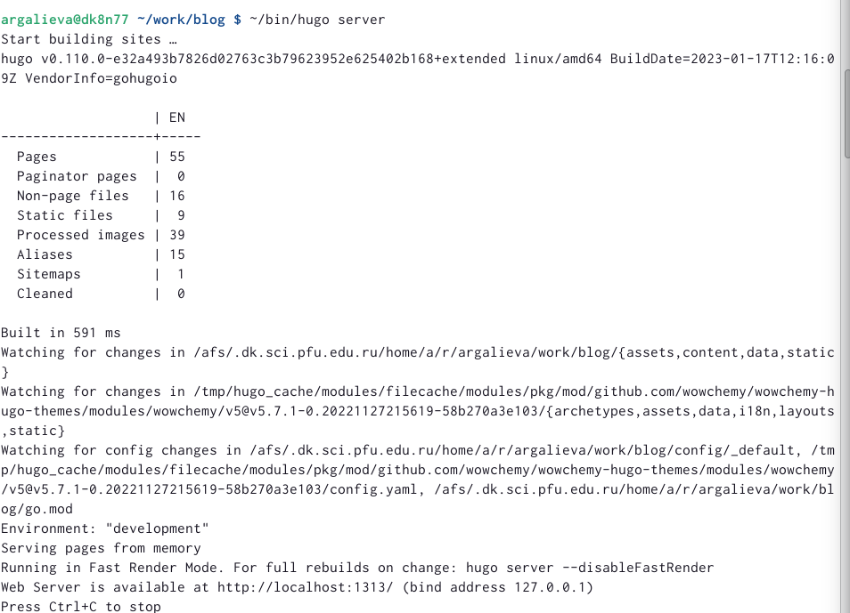{#fig:006 width=70%}

5. Создаем еще один репозиторий, чтобы сайт можно было открыть с любого ПК (рис. @fig:007)

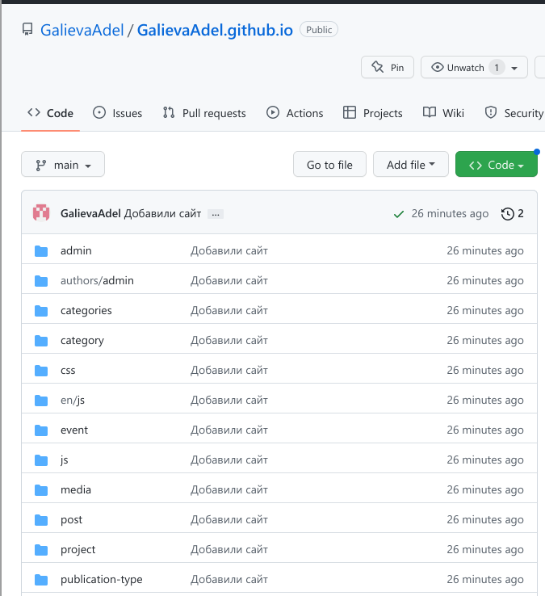{#fig:007 width=70%}

6. Клонируем новый созданный репозиторий, переключаемся на ветку main, создаём файл md и выгружаем на github (рис. @fig:008)

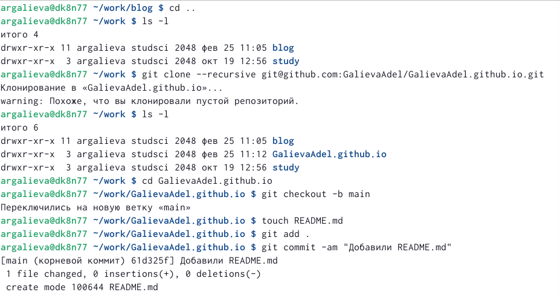{#fig:008 width=70%}

7. Переносим всю полученную информацию на основную ветку с помощию команды git push origin main, добавляем новые подкаталоги на github, восстанавливаем папку public (рис. @fig:009)

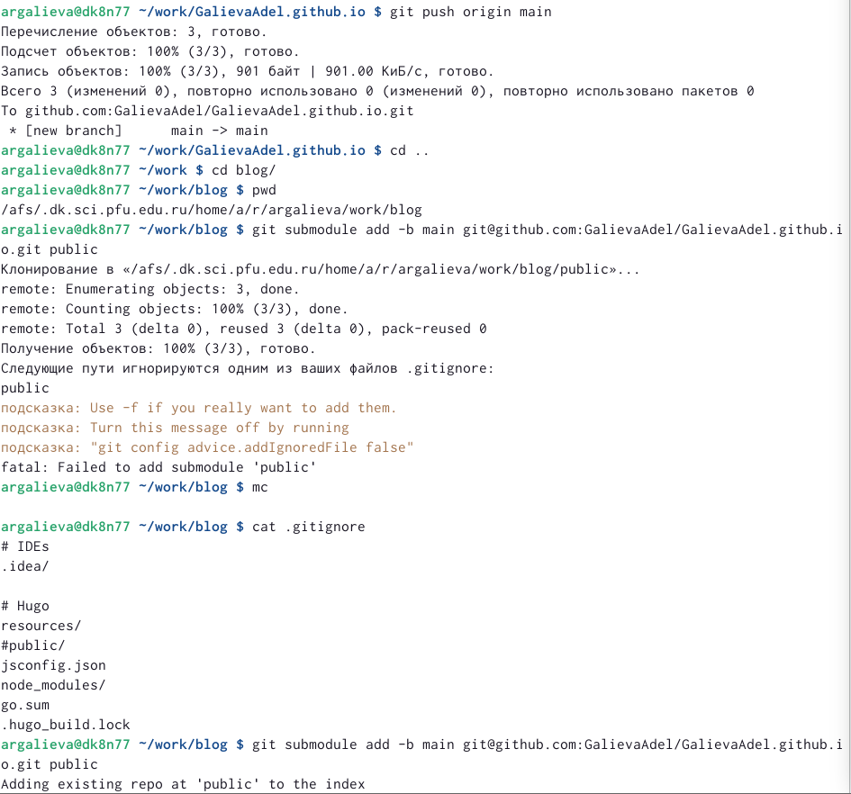{#fig:009 width=70%}

8. Проверяем привязку двух репозиториев к github и обновляем репозиторий (рис. @fig:010) (рис. @fig:011)

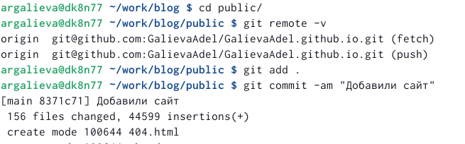{#fig:010 width=70%}

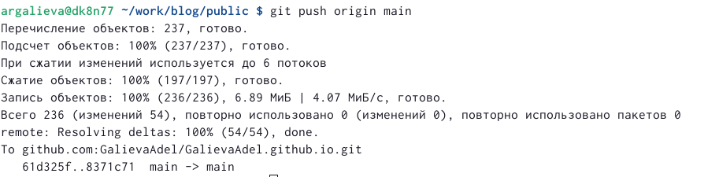{#fig:011 width=70%}

9. Заходим на личный сайт (рис. @fig:012)

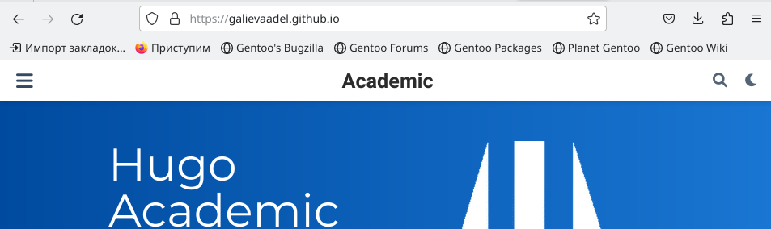{#fig:0012 width=70%}

# Выводы

Я создала шаблон для личного сайта и создала первоначальную настройку шаблона. 

# Список литературы{.unnumbered}

::: {#refs}
:::
