---
## Front matter
lang: ru-RU
title: "Индивидуальный проект"
subtitle: "Операционные системы"
author:
  - Галиева Аделина Руслановна
institute:
  - Российский университет дружбы народов, Москва, Россия

date: 17 марта 2023

## i18n babel
babel-lang: russian
babel-otherlangs: english

## Formatting pdf
toc: false
toc-title: Содержание
slide_level: 2
aspectratio: 169
section-titles: true
theme: metropolis
header-includes:
 - \metroset{progressbar=frametitle,sectionpage=progressbar,numbering=fraction}
 - '\makeatletter'
 - '\beamer@ignorenonframefalse'
 - '\makeatother'
---

## Цели и задачи

Добавить к сайту данные о себе.

## Содержание исследования

1. Размещаем фотографию владельца сайта, размещаем краткое описание владельца сайта, добавляем краткое информацию об интересах и добавляем информацию об образовании. 

##

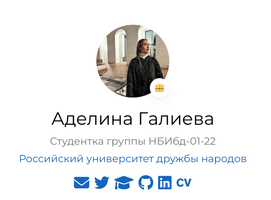{#fig:001 width=70%}

##

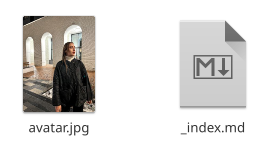{#fig:002 width=70%}

##

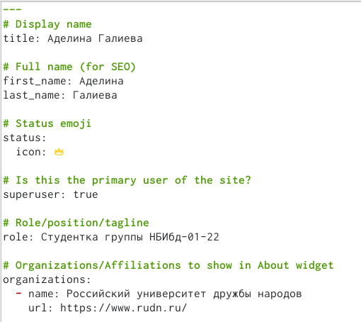{#fig:003 width=70%}

##

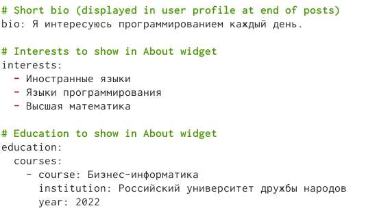{#fig:004 width=70%}

##

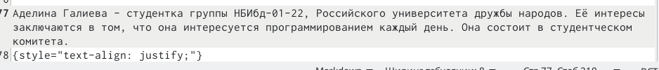{#fig:005 width=70%}

##

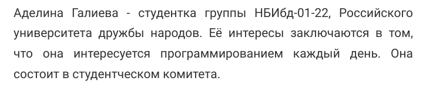{#fig:006 width=70%}

##

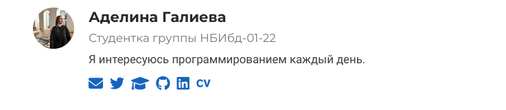{#fig:007 width=70%}

2. Делаем пост по прошедшей недели. 

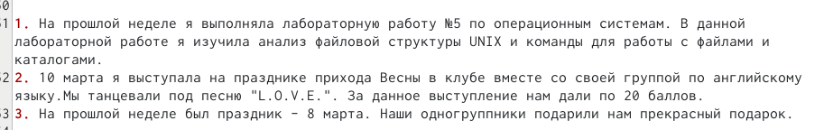{#fig:008 width=70%}

##

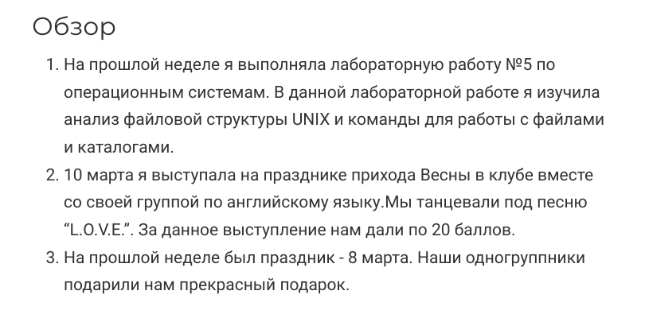{#fig:009 width=70%}

##

3. Добавляем пост на тему управления версиями Git.

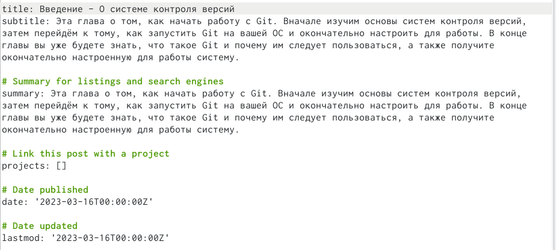{#fig:010 width=70%}

##

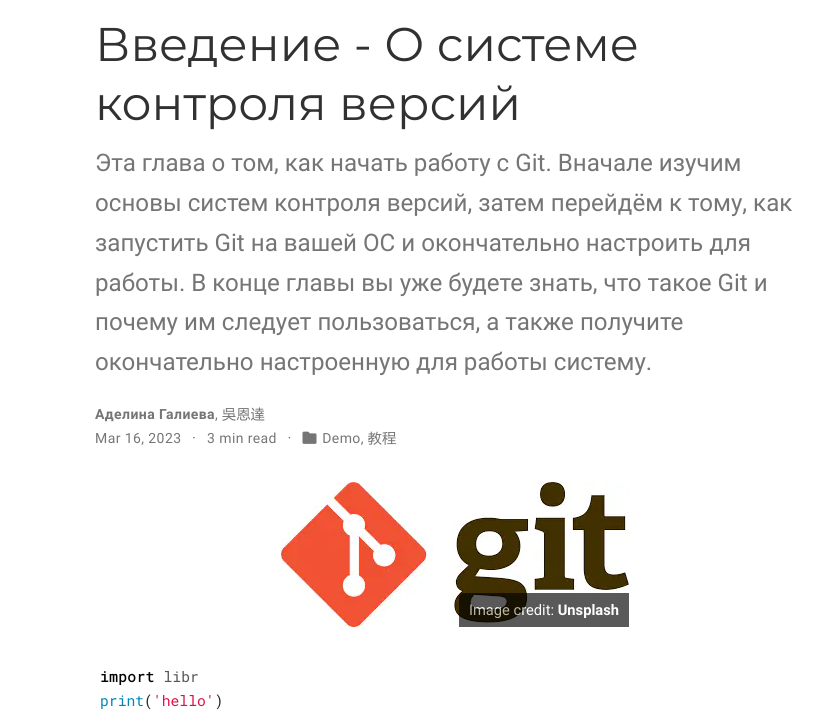{#fig:011 width=70%}

## Результаты

Выполнили второй шаг к созданию личного сайта.

## Итоговый слайд

В ходе выполения лабораторной работы, я добавила к сайту данные о себе.

