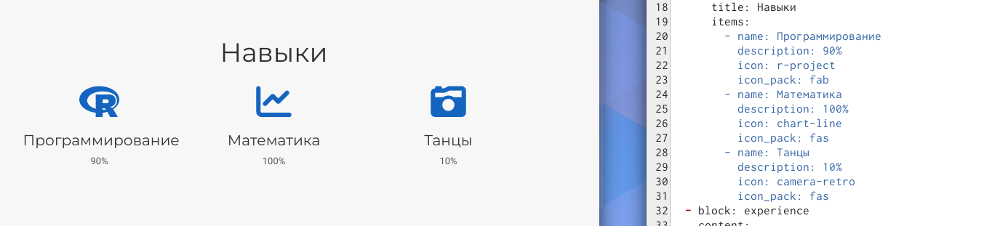
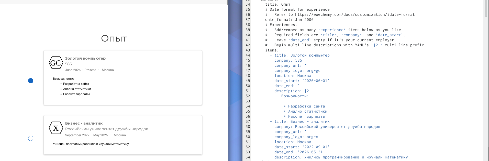
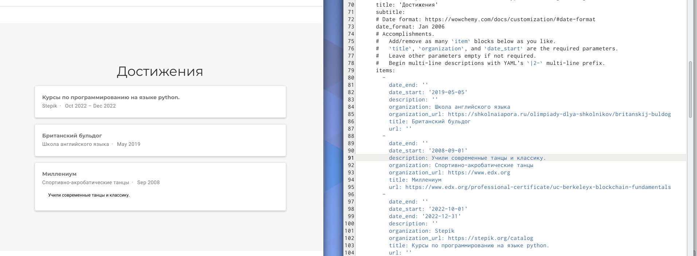
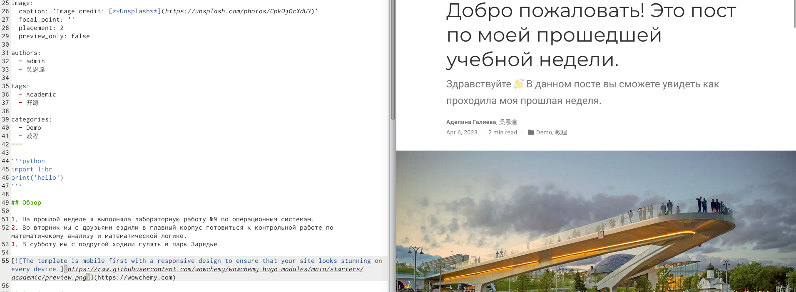
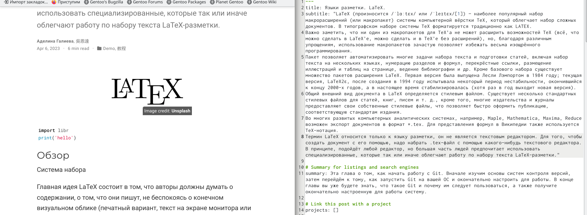

---
## Front matter
lang: ru-RU
title: "Индивидуальный проект"
subtitle: "Операционные системы"
author:
  - Галиева Аделина Руслановна
institute:
  - Российский университет дружбы народов, Москва, Россия

date: 06 апреля 2023

## i18n babel
babel-lang: russian
babel-otherlangs: english

## Formatting pdf
toc: false
toc-title: Содержание
slide_level: 2
aspectratio: 169
section-titles: true
theme: metropolis
header-includes:
 - \metroset{progressbar=frametitle,sectionpage=progressbar,numbering=fraction}
 - '\makeatletter'
 - '\beamer@ignorenonframefalse'
 - '\makeatother'
---

## Цели и задачи

Добавить к сайту достижения.

## Содержание исследования

1. Добавляем информацию о навыках. 

{#fig:001 width=70%}

##

2. Добавляем информацию об опыте. 

{#fig:002 width=70%}

##

3. Добавляем информацию о достижениях.

{#fig:003 width=70%}

##

4. Делаем пост по прошедшей неделе. 

{#fig:004 width=70%}

##

5. Добавляем пост на тему языки разметки LaTex.

{#fig:005 width=70%}

## Результаты

Выполнили третий шаг к созданию личного сайта.

## Итоговый слайд

В ходе выполения лабораторной работы, я добавила к сайту свои достижения. 
