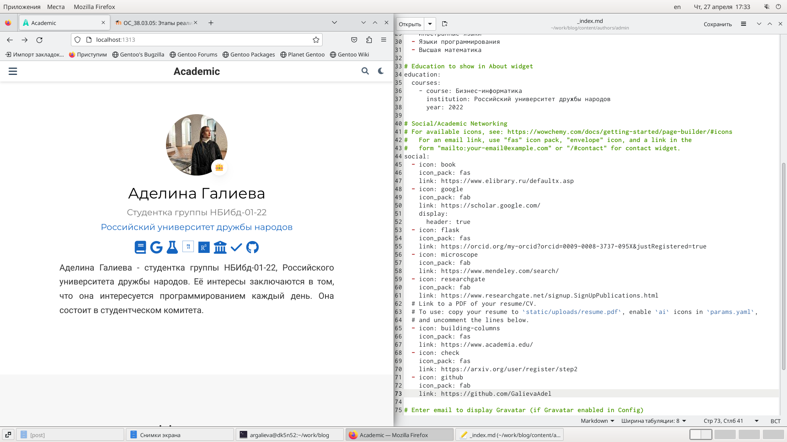
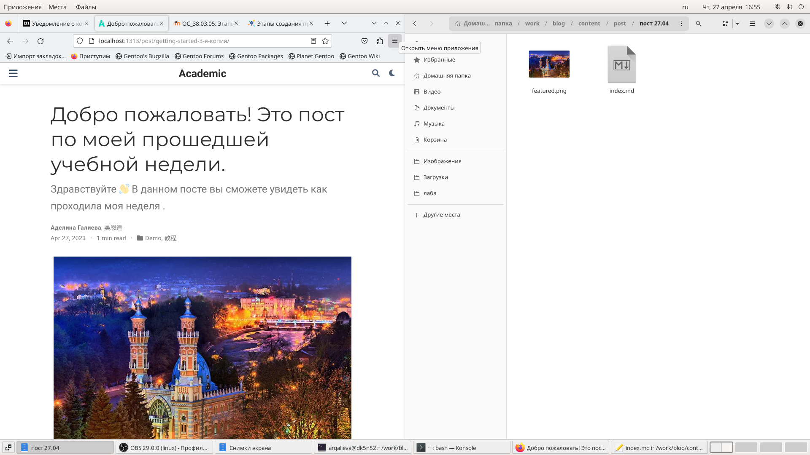
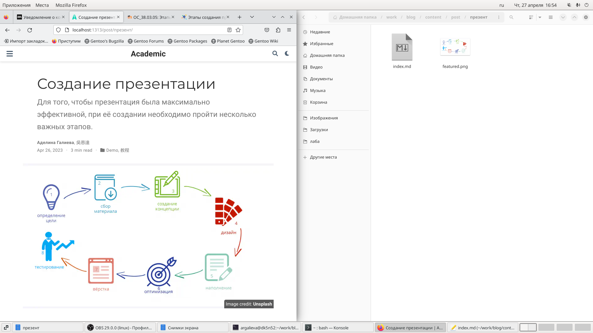

---
## Front matter
lang: ru-RU
title: "Индивидуальный проект"
subtitle: "Операционные системы"
author:
  - Галиева Аделина Руслановна
institute:
  - Российский университет дружбы народов, Москва, Россия

date: 27 апреля 2023

## i18n babel
babel-lang: russian
babel-otherlangs: english

## Formatting pdf
toc: false
toc-title: Содержание
slide_level: 2
aspectratio: 169
section-titles: true
theme: metropolis
header-includes:
 - \metroset{progressbar=frametitle,sectionpage=progressbar,numbering=fraction}
 - '\makeatletter'
 - '\beamer@ignorenonframefalse'
 - '\makeatother'
---

## Цели и задачи

Добавить к сайту ссылки на научные и библиометрические ресурсы.

## Содержание исследования

1. Зарегистрировалась на соответствующих ресурсах и разместила на них ссылки на сайте:. 

{#fig:001 width=70%}

##

2. Сделала пост по прошедшей неделе. 

{#fig:002 width=70%}

##

3. Сделала пост на тему "Создание презентаций". 

{#fig:003 width=70%}

## Результаты

Выполнили четвертый шаг к созданию личного сайта.

## Итоговый слайд

В ходе выполения лабораторной работы, я добавила ссылки на различные сайты.

